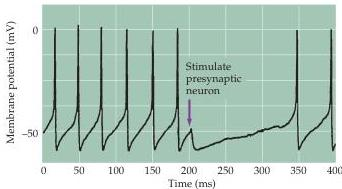
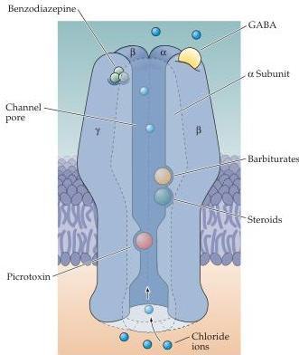

Chapter Six

inhibitory because their associated channels are permeable to  $\mathrm{Cl^-}$  (Figure 6.9A); the flow of the negatively charged chloride ions inhibits postsynaptic cells since the reversal potential for  $\mathrm{Cl^-}$  is more negative than the threshold for neuronal firing (see Figure 5.19B).
Like other ionotropic receptors, GABA receptors are pentamers assembled from a combination of five types of subunits ( $\alpha$ ,  $\beta$ ,  $\gamma$ ,  $\delta$ , and  $\rho$ ; see Figure 6.4C).
As a result of this subunit diversity, as well as variable stoichiometry of subunits, the function of  $\mathrm{GABA_A}$  receptors differs widely among neuronal types.
Drugs that act as agonists or modulators of postsynaptic GABA receptors, such as benzodiazepines and barbiturates, are used clinically to treat epilepsy and are effective sedatives and anesthetics.
Binding sites for GABA, barbiturates, steroids, and picrotoxin are all located within the pore domain of the channel (Figure 6.9B).
Another site, called the benzodiazepine binding site, lies outside the pore and modulates channel activity.
Benzodiazepines, such as diazepam (Valium®) and chlordiazepoxide (Librium®), are tranquilizing (anxiety reducing) drugs that enhance GABAergic transmission by binding to the  $\alpha$  and  $\delta$  subunits of  $\mathrm{GABA_A}$  receptors.
Barbiturates, such as phenobarbital and pentobarbital, are hypnotics that bind to the  $\alpha$  and  $\beta$  subunits of some GABA receptors and are used therapeutically for anesthesia and to control epilepsy.
Another drug that can alter the activity of GABA-mediated inhibitory circuits is alcohol; at least some aspects of drunken behavior are caused by the alcohol-mediated alterations in ionotropic GABA receptors.

Metabotropic GABA receptors  $\mathrm{(GABA_B)}$  are also widely distributed in brain.
Like the ionotropic  $\mathrm{GABA_A}$  receptors,  $\mathrm{GABA_B}$  receptors are inhibitory.
Rather than activating  $\mathrm{Cl^-}$  selective channels, however,  $\mathrm{GABA_B}$ -mediated inhibition is due to the activation of  $\mathrm{K}^+$  channels.
A second mechanism for

(A)

(B)
Figure 6.9 Ionotropic GABA receptors.
(A) Stimulation of a presynaptic GABAergic interneuron, at the time indicated by the arrow, causes a transient inhibition of action potential firing in its postsynaptic target.
This inhibitory response is caused by activation of postsynaptic  $\mathrm{GABA_A}$  receptors.
(B) Ionotropic GABA receptors contain two binding sites for GABA and numerous sites at which drugs bind to and modulate these receptors.
(A after Chavas and Marty, 2003).