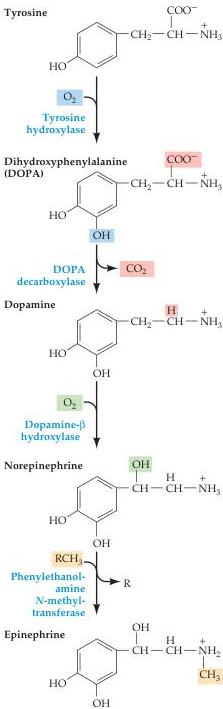

Neurotransmitters and Their Receptors 147

$\mathrm{GABA_B}$-mediated inhibition is by blocking $\mathrm{Ca^{2+}}$ channels, which tends to hyperpolarize postsynaptic cells.
Unlike most metabotropic receptors, $\mathrm{GABA_B}$ receptors appear to assemble as heterodimers of $\mathrm{GABA_B R1}$ and R2 subunits.

The distribution of the neutral amino acid glycine in the central nervous system is more localized than that of GABA.
About half of the inhibitory synapses in the spinal cord use glycine; most other inhibitory synapses use GABA.
Glycine is synthesized from serine by the mitochondrial isoform of serine hydroxymethyltransferase (Figure 6.8B), and is transported into synaptic vesicles via the same vesicular inhibitory amino acid transporter that loads GABA into vesicles.
Once released from the presynaptic cell, glycine is rapidly removed from the synaptic cleft by the plasma membrane glycine transporters.
Mutations in the genes coding for some of these enzymes result in hyperglycinemia, a devastating neonatal disease characterized by lethargy, seizures, and mental retardation.

The receptors for glycine are also ligand-gated $\mathrm{Cl^-}$ channels, their general structure mirroring that of the $\mathrm{GABA_A}$ receptors.
Glycine receptors are pentamers consisting of mixtures of the 4 gene products encoding glycine-binding $\alpha$ subunits, along with the accessory $\beta$ subunit.
Glycine receptors are potently blocked by strychnine, which may account for the toxic properties of this plant alkaloid (see Box B).

## The Biogenic Amines

Biogenic amine transmitters regulate many brain functions and are also active in the peripheral nervous system.
Because biogenic amines are implicated in such a wide range of behaviors (ranging from central homeostatic functions to cognitive phenomena such as attention), it is not surprising that defects in biogenic amines function are implicated in most psychiatric disorders.
The pharmacology of amine synapses is critically important in psychotherapy, with drugs affecting the synthesis, receptor binding, or catabolism of these neurotransmitters being among the most important agents in the armamentarium of modern pharmacology (Box E).
Many drugs of abuse also act on biogenic amine pathways.

There are five well-established biogenic amine neurotransmitters: the three catecholamines—dopamine, norepinephrine (noradrenaline), and epinephrine (adrenaline)—and histamine and serotonin (see Figure 6.1).
All the catecholamines (so named because they share the catechol moiety) are derived from a common precursor, the amino acid tyrosine (Figure 6.10).
The first step in catecholamine synthesis is catalyzed by tyrosine hydroxylase in a reaction requiring oxygen as a co-substrate and tetrahydrobiopterin as a cofactor to synthesize dihydroxyphenylalanine (DOPA).
Histamine and serotonin are synthesized via other routes, as described below.

- Dopamine is present in several brain regions (Figure 6.11A), although the major dopamine-containing area of the brain is the corpus striatum, which receives major input from the substantia nigra and plays an essential role in the coordination of body movements.
In Parkinson's disease, for instance, the dopaminergic neurons of the substantia nigra degenerate, leading to a characteristic motor dysfunction (see Box B in Chapter 17).
Dopamine is also believed to be involved in motivation, reward, and reinforcement, and many drugs of abuse work by affecting dopaminergic synapses in the CNS (see Box A).
In addition to these roles in the CNS, dopamine also plays a poorly understood role in some sympathetic ganglia.

Figure 6.10 The biosynthetic pathway for the catecholamine neurotransmitters.
The amino acid tyrosine is the precursor for all three catecholamines.
The first step in this reaction pathway, catalyzed by tyrosine hydroxylase, is rate-limiting.