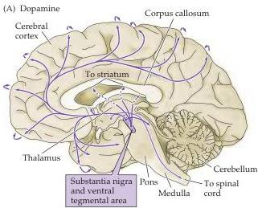
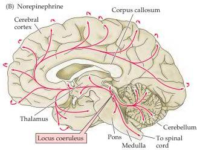
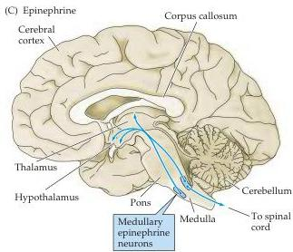

Neurotransmitters and Their Receptors 149

Figure 6.11 The distribution in the human brain of neurons and their projections (arrows) containing catecholamine neurotransmitters.
Curved arrows along the perimeter of the cortex indicate the innervation of lateral cortical regions not shown in this midsagittal plane of section.

Dopamine is produced by the action of DOPA decarboxylase on DOPA (see Figure 6.10).
Following its synthesis in the cytoplasm of presynaptic terminals, dopamine is loaded into synaptic vesicles via a vesicular monoamine transporter (VMAT).
Dopamine action in the synaptic cleft is terminated by reuptake of dopamine into nerve terminals or surrounding glial cells by a $\mathrm{Na^{+}}$-dependent dopamine transporter, termed DAT.
Cocaine apparently produces its psychotropic effects by binding to and inhibiting DAT, yielding a net increase in dopamine release from specific brain areas.
Amphetamine, another addictive drug, also inhibits DAT as well as the transporter for norepinephrine (see below).
The two major enzymes involved in the catabolism of dopamine are monoamine oxidase (MAO) and catechol O-methyltransferase (COMT).
Both neurons and glia contain mitochondrial MAO and cytoplasmic COMT.
Inhibitors of these enzymes, such as phenelzine and tranylcypromine, are used clinically as antidepressants (see Box E).

Once released, dopamine acts exclusively by activating G-protein-coupled receptors.
These are mainly dopamine-specific receptors, although $\beta$-adrenergic receptors also serve as important targets of norepinephrine and epinephrine (see below).
Most dopamine receptor subtypes (see Figure 6.5B)