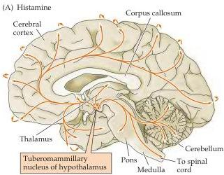
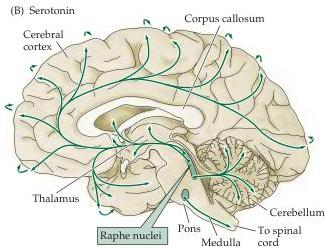

Neurotransmitters and Their Receptors 151

Figure 6.12 The distribution in the human brain of neurons and their projections (arrows) containing histamine (A) or serotonin (B).
Curved arrows along the perimeter of the cortex indicate the innervation of lateral cortical regions not shown in this midsagittal plane of section.

- Histamine is found in neurons in the hypothalamus that send sparse but widespread projections to almost all regions of the brain and spinal cord (Figure 6.12A).
The central histamine projections mediate arousal and attention, similar to central ACh and norepinephrine projections.
Histamine also controls the reactivity of the vestibular system.
Allergic reactions or tissue damage cause release of histamine from mast cells in the bloodstream.
The close proximity of mast cells to blood vessels, together with the potent actions of histamine on blood vessels, also raises the possibility that histamine may influence brain blood flow.

Histamine is produced from the amino acid histidine by a histidine decarboxylase (Figure 6.13A) and is transported into vesicles via the same VMAT as the catecholamines.
No plasma membrane histamine transporter has been identified yet.
Histamine is degraded by the combined actions of histamine methyltransferase and MAO.

There are three known types of histamine receptors, all of which are G-protein-coupled receptors (Figure 6.5B).
Because of the importance of histamine receptors in the mediation of allergic responses, many histamine receptor antagonists have been developed as antihistamine agents.
Antihistamines that cross the blood-brain barrier, such as diphenhydramine (Benadryl®), act as sedatives by interfering with the roles of histamine in CNS arousal.
Antagonists of the H₁ receptor also are used to prevent motion sickness, perhaps because of the role of histamine in controlling vestibular function.
H₂ receptors control the secretion of gastric acid in the digestive system, allowing H₂ receptor antagonists to be used in the treatment of a variety of upper gastrointestinal disorders (e.g., peptic ulcers).

- Serotonin, or 5-hydroxytryptamine (5-HT), was initially thought to increase vascular tone by virtue of its presence in serum (hence the name serotonin).
Serotonin is found primarily in groups of neurons in the raphe region of the pons and upper brainstem, which have widespread projections to the forebrain (see Figure 6.12B) and regulate sleep and wakefulness (see Chapter 27).
5-HT occupies a place of prominence in neuropharmacology because a large number of antipsychotic drugs that are valuable in the treatment of depression and anxiety act on serotonergic pathways (see Box E).

5-HT is synthesized from the amino acid tryptophan, which is an essential dietary requirement.
Tryptophan is taken up into neurons by a plasma mem