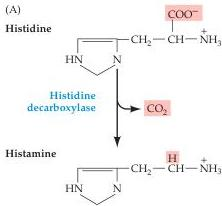
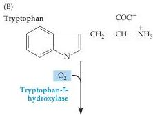
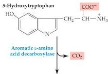
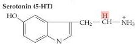

Chapter Six

Figure 6.13 Synthesis of histamine and serotonin.
(A) Histamine is synthesized from the amino acid histidine.
(B) Serotonin is derived from the amino acid tryptophan by a two-step process that requires the enzymes tryptophan-5-hydroxylase and a decarboxylase.

brane transporter and hydroxylated in a reaction catalyzed by the enzyme tryptophan-5-hydroxylase (Figure 6.13B), the rate-limiting step for 5-HT synthesis.
Loading of 5-HT into synaptic vesicles is done by the VMAT that is also responsible for loading of other monoamines into synaptic vesicles.
The synaptic effects of serotonin are terminated by transport back into nerve terminals via a specific serotonin transporter (SERT).
Many antidepressant drugs are selective serotonin reuptake inhibitors (SSRIs) that inhibit transport of 5-HT by SERT.
Perhaps the best known example of an SSRI is Prozac (see Box E).
The primary catabolic pathway for 5-HT is mediated by MAO.

A large number of 5-HT receptors have been identified.
Most 5-HT receptors are metabotropic (see Figure 6.5B).
These have been implicated in behaviors, including the emotions, circadian rhythms, motor behaviors, and state of mental arousal.
Impairments in the function of these receptors have been implicated in numerous psychiatric disorders, such as depression, anxiety disorders, and schizophrenia (see Chapter 28), and drugs acting on serotonin receptors are effective treatments for a number of these conditions.
Activation of 5-HT receptors also mediates satiety and decreased food consumption, which is why serotonergic drugs are sometimes useful in treating eating disorders.

Only one group of serotonin receptors, called the 5-HT₃ receptors, are ligand-gated ion channels (see Figure 6.4C).
These are non-selective cation channels and therefore mediate excitatory postsynaptic responses.
Their general structure, with functional channels formed by assembly of multiple subunits, is similar to the other ionotropic receptors described in the chapter.
Two types of 5-HT₃ subunit are known, and form functional channels by assembling as a heteromultimer.
5-HT receptors are targets for a wide variety of therapeutic drugs including ondansetron (Zofran®) and granisetron (Kytril®), which are used to prevent postoperative nausea and chemotherapy-induced emesis.

## ATP and Other Purines

Interestingly, all synaptic vesicles contain ATP, which is co-released with one or more "classical" neurotransmitters.
This observation raises the possibility that ATP acts as a co-transmitter.
It has been known since the 1920s that the extracellular application of ATP (or its breakdown products AMP and adenosine) can elicit electrical responses in neurons.
The idea that some purines (so named because all these compounds contain a purine ring; see Figure 6.1) are also neurotransmitters has now received considerable experimental support.
ATP acts as an excitatory neurotransmitter in motor neurons of the spinal cord, as well as sensory and autonomic ganglia.
Postsynaptic actions of ATP have also been demonstrated in the central nervous system, specifically for dorsal horn neurons and in a subset of hippocampal neurons.
Adenosine, however, cannot be considered a classical neurotransmitter because it is not stored in synaptic vesicles or released in a Ca²⁺-dependent manner.
Rather, it is generated from ATP by the action of extracellular enzymes.
A number of enzymes, such as apyrase and ecto-5′ nucleotidase, as well as nucleoside transporters are involved in the rapid catabolism and removal of purines from extracellular locations.
Despite the relative novelty of this evidence, it suggests that excitatory transmission via purinergic synapses is widespread in the mammalian brain.

In accord with this evidence, receptors for both ATP and adenosine are widely distributed in the nervous system, as well as many other tissues.