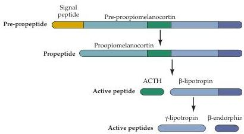
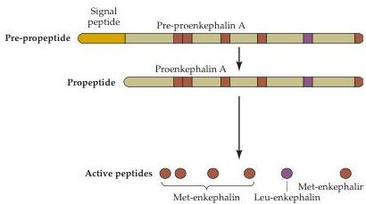

Chapter Six

Figure 6.14 Proteolytic processing of the pre-propeptides pre-proopiomelanocortin (A) and pre-proenkephalin A (B).
For each pre-propeptide, the signal sequence is indicated in orange at the left; the locations of active peptide products are indicated by different colors.
The maturation of the pre-propeptides involves cleaving the signal sequence and other proteolytic processing.
Such processing can result in a number of different neuroactive peptides such as ACTH,  $\gamma$ -lipotropin, and  $\beta$ -endorphin (A), or multiple copies of the same peptide, such as met-enkephalin (B).

(B)

the brain/gut peptides, opioid peptides, pituitary peptides, hypothalamic releasing hormones, and a catch-all category containing other peptides that are not easily classified.

Substance P is an example of the first of these categories (Figure 6.15A).
The study of neuropeptides actually began more than 60 years ago with the accidental discovery of substance P, a powerful hypotensive agent.
(The peculiar name derives from the fact that this molecule was an unidentified component of powder extracts from brain and intestine.) This 11-amino-acid peptide (see Figure 6.15) is present in high concentrations in the human hippocampus, neocortex, and also in the gastrointestinal tract; hence its classification as a brain/gut peptide.
It is also released from C fibers, the small-diameter afferents in peripheral nerves that convey information about pain and temperature (as well as postganglionic autonomic signals).
Substance P is a sensory neurotransmitter in the spinal cord, where its release can be inhibited by opioid peptides released from spinal cord interneurons, resulting in the suppression of pain (see Chapter 9).
The diversity of neuropeptides is highlighted by the finding that the gene coding for substance P encodes a number of other neuroactive peptides including neurokinin A, neuropeptide K, and neuropeptide  $\gamma$ .

An especially important category of peptide neurotransmitters is the family of opioids (Figure 6.15B).
These peptides are so named because they bind