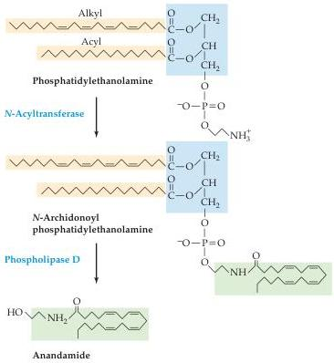
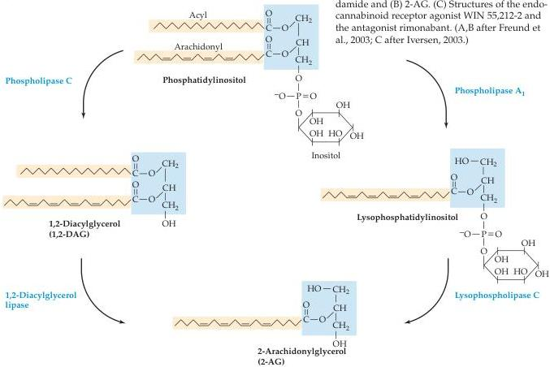

(A)

(B)
Figure 6.16 Endocannabinoid signals involved in synaptic transmission.
Possible mechanism of production of the endocannabinoids (A) anandamide and (B) 2-AG.
(C) Structures of the endocannabinoid receptor agonist WIN 55,212-2 and the antagonist rimonabant.
(A,B after Freund et al., 2003; C after Iversen, 2003.)