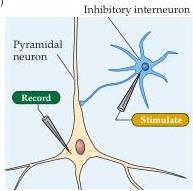
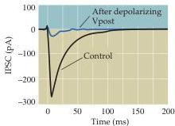
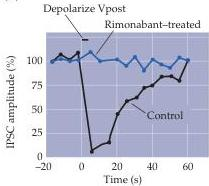
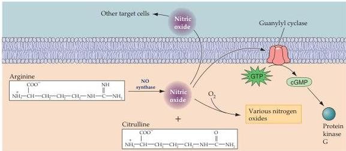

Neurotransmitters and Their Receptors 159

(A)

(B)

(C)

Figure 6.17 Endocannabinoid-mediated retrograde control of GABA release.
(A) Experimental arrangement.
Stimulation of a presynaptic interneuron causes release of GABA onto a postsynaptic pyramidal neuron.
(B) IPSCs elicited by the inhibitory synapse (control) are reduced in amplitude following a brief depolarization of the postsynaptic neuron.
This reduction in the IPSC is due to less GABA being released from the presynaptic interneuron.
(C) The reduction in IPSC amplitude produced by postsynaptic depolarization lasts a few seconds and is mediated by endocannabinoids, because it is prevented by the endocannabinoid receptor antagonist rimonabant.
(B,C after Ohno-Shosaku et al., 2001.)

- Nitric oxide (NO) is an unusual but especially interesting chemical signal.
NO is a gas that is produced by the action of nitric oxide synthase, an enzyme that converts the amino acid arginine into a metabolite (citrulline) and simultaneously generates NO (Figure 6.18).
NO is produced by an enzyme, nitric oxide synthase.
Neuronal NO synthase is regulated by $\mathrm{Ca^{2+}}$ binding to the $\mathrm{Ca^{2+}}$ sensor protein calmodulin (see Chapter 7).
Once produced, NO can permeate the plasma membrane, meaning that NO generated inside one cell can travel through the extracellular medium and act within nearby cells.
Thus, this gaseous signal has a range of influence that extends well beyond the cell of origin, diffusing a few tens of micrometers from its site of production before it is degraded.
This property makes NO a

Figure 6.18 Synthesis, release, and termination of NO.