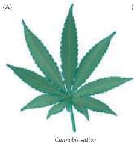
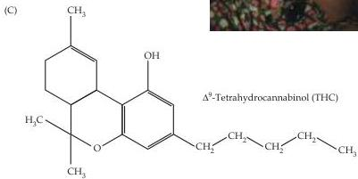
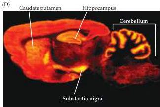

Chapter Six

# Box F

## Marijuana and the Brain

Medicinal use of the marijuana plant, *Cannabis sativa* (Figure A), dates back thousands of years.
Ancient civilizations—including both Greek and Roman societies in Europe, as well as Indian and Chinese cultures in Asia—appreciated that this plant was capable of producing relaxation, euphoria, and a number of other psychopharmacological actions.
In more recent times, medicinal use of marijuana has largely subsided (although it remains useful in relieving the symptoms of terminal cancer patients); the recreational use of marijuana (Figure B) has become so popular that some societies have decriminalized its use.

Understanding the brain mechanisms underlying the actions of marijuana was advanced by the discovery that a cannabinoid, $\Delta^9$-tetrahydrocannabinol (THC; Figure C), is the active component of marijuana.
This finding led to the development of synthetic derivatives, such as WIN 55,212-2 and rimonabant (see Figure 6.16), that have served as valuable tools for probing the brain actions of THC.
Of particular interest is that receptors for these cannabinoids exist in the brain and exhibit marked regional variations in distribution, being especially enriched in the brain areas—such as substantia nigra and caudate putamen—that have been implicated in drug abuse (Figure D).
The presence of these brain receptors for cannabinoids led in turn to a search for endogenous cannabinoid compounds in the brain, culminating in the discovery of endocannabinoids such as 2-AG and anandamide (see Figure 6.16).
This path of discovery closely parallels the identification of endogenous opioid peptides, which resulted from the search for endogenous morphine-like compounds in the brain (see text and Table 6.2).

Given that THC interacts with brain endocannabinoid receptors, particularly

(A) Leaf of *Cannabis sativa*, the marijuana plant.
(B) Smoking ground-up *Cannabis* leaves is a popular method of achieving the euphoric effects of marijuana.
(C) Structure of THC ($\Delta^9$-tetrahydrocannabinol), the active ingredient of marijuana.
(D) Distribution of brain CB1 receptors, visualized by examining the binding of CP-55,940, a CB1 receptor ligand.
(B photo © Henry Diltz/Corbis; C after Iversen, 2003; D courtesy of M.
Herkenham, NIMH.)