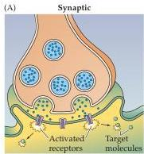
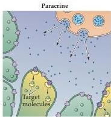
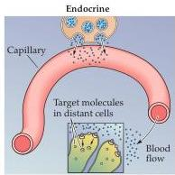
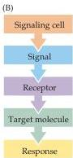

Chapter Seven

Figure 7.1 Chemical signaling mechanisms.
(A) Forms of chemical communication include synaptic transmission, paracrine signaling, and endocrine signaling.
(B) The essential components of chemical signaling are: cells that initiate the process by releasing signaling molecules; specific receptors on target cells; second messenger target molecules; and subsequent cellular responses.

that transduces the information provided by the signal, and a target molecule that mediates the cellular response (Figure 7.1B).
The part of this process that take place within the confines of the target cell is called intracellular signal transduction.
A good example of transduction in the context of intercellular communication is the sequence of events triggered by chemical synaptic transmission (see Chapter 5): Neurotransmitters serve as the signal, neurotransmitter receptors serve as the transducing receptor, and the target molecule is an ion channel that is altered to cause the electrical response of the postsynaptic cell.
In many cases, however, synaptic transmission activates additional intracellular pathways that have a variety of functional consequences.
For example, the binding of the neurotransmitter norepinephrine to its receptor activates GTP-binding proteins, which produces second messengers within the postsynaptic target, activates enzyme cascades, and eventually changes the chemical properties of numerous target molecules within the affected cell.

A general advantage of chemical signaling in both intercellular and intracellular contexts is signal amplification.
Amplification occurs because individual signaling reactions can generate a much larger number of molecular products than the number of molecules that initiate the reaction.
In the case of norepinephrine signaling, for example, a single norepinephrine molecule binding to its receptor can generate many thousands of second messenger molecules (such as cyclic AMP), yielding an amplification of tens of thousands of phosphates transferred to target proteins (Figure 7.2).
Similar amplification occurs in all signal transduction pathways.
Because the transduction processes often are mediated by a sequential set of enzymatic reactions, each with its own amplification factor, a small number of signal molecules ultimately can activate a very large number of target molecules.
Such amplification guarantees that a physiological response is evoked in the face of other, potentially countervailing, influences.

Another rationale for these complex signal transduction schemes is to permit precise control of cell behavior over a wide range of times.
Some molecular interactions allow information to be transferred rapidly, while others are slower and longer lasting.
For example, the signaling cascades associated with synaptic transmission at neuromuscular junctions allow a person to respond to rapidly changing cues, such as the trajectory of a pitched ball, while the slower responses triggered by adrenal medullary hormones (epinephrine and norepinephrine) secreted during a challenging game produce slower (and longer lasting) effects on muscle metabolism (see Chapter 20) and emotional state (see Chapter 29).
To encode information that varies so