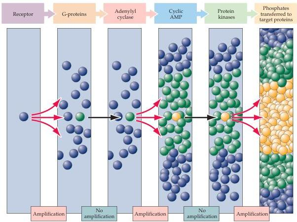

Molecular Signaling within Neurons 167

Figure 7.2 Amplification in signal transduction pathways.
The activation of a single receptor by a signaling molecule, such as the neurotransmitter norepinephrine, can lead to the activation of numerous G-proteins inside cells.
These activated proteins can bind to other signaling molecules, such as the enzyme adenylyl cyclase.
Each activated enzyme molecule generates a large number of cAMP molecules.
cAMP binds to and activates another family of enzymes, protein kinases.
These enzymes can then phosphorylate many target proteins.
While not every step in this signaling pathway involves amplification, overall the cascade results in a tremendous increase in the potency of the initial signal.

widely over time, the concentration of the relevant signaling molecules must be carefully controlled.
On one hand, the concentration of every signaling molecule within the signaling cascade must return to subthreshold values before the arrival of another stimulus.
On the other hand, keeping the intermediates in a signaling pathway activated is critical for a sustained response.
Having multiple levels of molecular interactions facilitates the intricate timing of these events.

## The Activation of Signaling Pathways

The molecular components of these signal transduction pathways are always activated by a chemical signaling molecule.
Such signaling molecules can be grouped into three classes: cell-impermeant, cell-permeant, and cell-associated signaling molecules (Figure 7.3).
The first two classes are secreted molecules and thus can act on target cells removed from the site of signal synthesis or release.
Cell-impermeant signaling molecules typically bind to receptors associated with cell membranes.
Hundreds of secreted molecules have now been identified, including the neurotransmitters discussed in Chapter 6, as well as proteins such as neurotrophic factors (see Chapter 22), and peptide hormones such as glucagon, insulin, and various reproductive hormones.
These signaling molecules are typically short-lived, either because they are rapidly metabolized or because they are internalized by endocytosis once bound to their receptors.