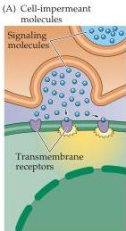
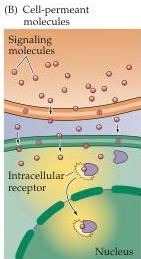
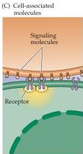

Chapter Seven

Figure 7.3 Three classes of cell signaling molecules.
(A) Cell-impermeant molecules, such as neurotransmitters, cannot readily traverse the plasma membrane of the target cell and must bind to the extracellular portion of transmembrane receptor proteins.
(B) Cell-permeant molecules are able to cross the plasma membrane and bind to receptors in the cytoplasm or nucleus of target cells.
(C) Cell-associated molecules are presented on the extracellular surface of the plasma membrane.
These signals activate receptors on target cells only if they are directly adjacent to the signaling cell.

Cell-permeant signaling molecules can cross the plasma membrane to act directly on receptors that are inside the cell.
Examples include numerous steroid (glucocorticoids, estradiol, and testosterone) and thyroid (thyroxin) hormones, and retinoids.
These signaling molecules are relatively insoluble in aqueous solutions and are often transported in blood and other extracellular fluids by binding to specific carrier proteins.
In this form, they may persist in the bloodstream for hours or even days.

The third group of chemical signaling molecules, cell-associated signaling molecules, are arrayed on the extracellular surface of the plasma membrane.
As a result, these molecules act only on other cells that are physically in contact with the cell that carries such signals.
Examples include proteins such as the integrins and neural cell adhesion molecules (NCAMs) that influence axonal growth (see Chapter 22).
Membrane-bound signaling molecules are more difficult to study, but are clearly important in neuronal development and other circumstances where physical contact between cells provides information about cellular identities.

## Receptor Types

Regardless of the nature of the initiating signal, cellular responses are determined by the presence of receptors that specifically bind the signaling molecules.
Binding of signal molecules causes a conformational change in the receptor, which then triggers the subsequent signaling cascade within the affected cell.
Given that chemical signals can act either at the plasma membrane or within the cytoplasm (or nucleus) of the target cell, it is not surprising that receptors are actually found on both sides of the plasma membrane.
The receptors for impermeant signal molecules are membrane-spanning proteins.
The extracellular domain of such receptors includes the binding site for the signal, while the intracellular domain activates intracellular signaling cascades after the signal binds.
A large number of these receptors have been identified and are grouped into families defined by the mechanism used to transduce signal binding into a cellular response (Figure 7.4).