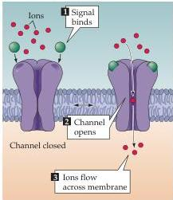
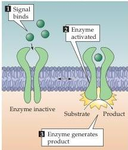
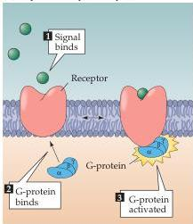
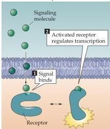

Molecular Signaling within Neurons 169

(A) Channel-linked receptors

(B) Enzyme-linked receptors

(C) G-protein-coupled receptors

(D) Intracellular receptors

Channel-linked receptors (also called ligand-gated ion channels) have the receptor and transducing functions as part of the same protein molecule.
Interaction of the chemical signal with the binding site of the receptor causes the opening or closing of an ion channel pore in another part of the same molecule.
The resulting ion flux changes the membrane potential of the target cell and, in some cases, can also lead to entry of $\mathrm{Ca^{2+}}$ ions that serve as a second messenger signal within the cell.
Good examples of such receptors are the ionotropic neurotransmitter receptors described in Chapters 5 and 6.

Enzyme-linked receptors also have an extracellular binding site for chemical signals.
The intracellular domain of such receptors is an enzyme whose catalytic activity is regulated by the binding of an extracellular signal.
The great majority of these receptors are protein kinases, often tyrosine kinases, that phosphorylate intracellular target proteins, thereby changing the physiological function of the target cells.
Noteworthy members of this