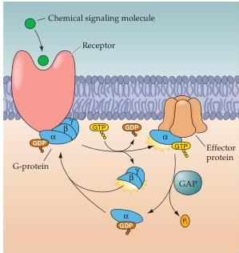
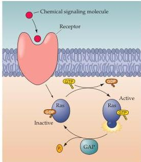

Molecular Signaling within Neurons 171

(A) Heterotrimeric G-proteins

(B) Monomeric G-proteins

large number of small GTPases have been identified and can be sorted into five different subfamilies with different functions.
For instance, some are involved in vesicle trafficking in the presynaptic terminal or elsewhere in the neuron, while others play a central role in protein and RNA trafficking in and out of the nucleus.

Termination of signaling by both heterotrimeric and monomeric G-proteins is determined by hydrolysis of GTP to GDP.
The rate of GTP hydrolysis is an important property of a particular G-protein that can be regulated by other proteins, termed GTPase-activating proteins (GAPs).
By replacing GTP with GDP, GAPs return G-proteins to their inactive form.
GAPs were first recognized as regulators of small G-proteins, but recently similar proteins have been found to regulate the $\alpha$ subunits of heterotrimeric G-proteins.
Hence, monomeric and trimeric G-proteins function as molecular timers that are active in their GTP-bound state, and become inactive when they have hydrolized the bound GTP to GDP (Figure 7.5B).

Activated G-proteins alter the function of many downstream effectors.
Most of these effectors are enzymes that produce intracellular second messengers.
Effector enzymes include adenylyl cyclase, guanylyl cyclase, phospholipase C, and others (Figure 7.6).
The second messengers produced by these enzymes trigger the complex biochemical signaling cascades discussed in the next section.
Because each of these cascades is activated by specific G-protein subunits, the pathways activated by a particular receptor are determined by the specific identity of the G-protein subunits associated with it.

As well as activating effector molecules, G-proteins can also directly bind to and activate ion channels.
For example, some neurons, as well as heart muscle cells, have G-protein-coupled receptors that bind acetylcholine.
Because these receptors are also activated by the agonist muscarine, they are usually called muscarinic receptors (see Chapters 6 and 20).
Activation of muscarinic receptors can open $\mathbf{K}^{+}$ channels, thereby inhibiting the rate at which the neuron fires action potentials, or slowing the heartbeat of muscle

Figure 7.5 Types of GTP-binding protein.
(A) Heterotrimeric G-proteins are composed of three distinct subunits ($\alpha$, $\beta$, and $\gamma$).
Receptor activation causes the binding of the G-protein and the $\alpha$ subunit to exchange GDP for GTP, leading to a dissociation of the $\alpha$ and $\beta\gamma$ subunits.
The biological actions of these G-proteins are terminated by hydrolysis of GTP, which is enhanced by GTPase-activating (GAP) proteins.
(B) Monomeric G-proteins use similar mechanisms to relay signals from activated cell surface receptors to intracellular targets.
Binding of GTP stimulates the biological actions of these G-proteins, and their activity is terminated by hydrolysis of GTP, which is also regulated by GAP proteins.