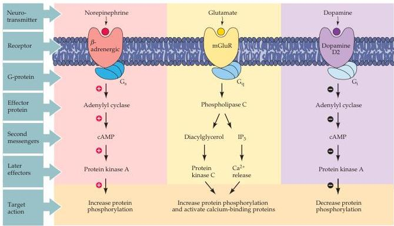

Chapter Seven

Figure 7.6 Effector pathways associated with G-protein-coupled receptors.
In all three examples shown here, binding of a neurotransmitter to such a receptor leads to activation of a G-protein and subsequent recruitment of second messenger pathways.
 $G_{s}$ ,  $G_{q}$ , and  $G_{i}$  refer to three different types of heterotrimeric G-protein.

cells.
These inhibitory responses are believed to be the result of  $\beta \gamma$  subunits of G-proteins binding to the  $\mathbf{K}^{+}$  channels.
The activation of  $\alpha$  subunits can also lead to the rapid closing of voltage-gated  $\mathrm{Ca^{2 + }}$  and  $\mathrm{Na^{+}}$  channels.
Because these channels carry inward currents involved in generating action potentials, closing them makes it more difficult for target cells to fire (see Chapters 3 and 4).

In summary, the binding of chemical signals to their receptors activates cascades of signal transduction events in the cytosol of target cells.
Within such cascades, G-proteins serve a pivotal function as the molecular transducing elements that couple membrane receptors to their molecular effectors within the cell.
The diversity of G-proteins and their downstream targets leads to many types of physiological responses.
By directly regulating the gating of ion channels, G-proteins can influence the membrane potential of target cells.

# Second Messengers

Neurons use many different second messengers as intracellular signals.
These messengers differ in the mechanism by which they are produced and removed, as well as their downstream targets and effects (Figure 7.7A).
This section summarizes the attributes of some of the principal second messengers.

- Calcium.
The calcium ion  $(\mathrm{Ca}^{2+})$  is perhaps the most common intracellular messenger in neurons.
Indeed, few neuronal functions are immune to the influence—direct or indirect—of  $\mathrm{Ca}^{2+}$ .
In all cases, information is transmitted by a transient rise in the cytoplasmic calcium concentration, which