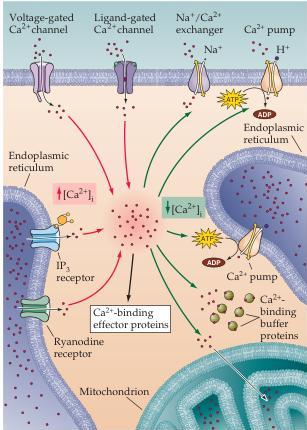
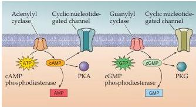
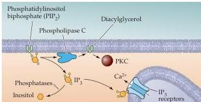

Molecular Signaling within Neurons 173

(A)

|  Second messenger | Sources | Intracellular targets | Removal mechanisms  |
| --- | --- | --- | --- |
|  Ca^{2+} | Plasma membrane: Voltage-gated Ca^{2+} channels | Calmodulin
Protein kinases | Plasma membrane: Na^{+}/Ca^{2+} exchanger
Ca^{2+} pump  |
|   |  Various ligand-gated channels | Protein phosphatases
Ion channels | Endoplasmic reticulum: Ca^{2+} pump  |
|   |  Endoplasmic reticulum: IP_{3} receptors | Synaptotagmin
Many other Ca^{2+}-binding proteins | Mitochondria  |
|   |  Ryanodine receptors |  |   |
|  Cyclic AMP | Adenylyl cyclase acts on ATP | Protein kinase A
Cyclic nucleotide-gated channels | cAMP phosphodiesterase  |
|  Cyclic GMP | Guanylyl cyclase acts on GTP | Protein kinase G
Cyclic nucleotide-gated channels | cGMP phosphodiesterase  |
|  IP_{3} | Phospholipase C acts on PIP_{2} | IP_{3} receptors on endoplasmic reticulum | Phosphatases  |
|  Diacylglycerol | Phospholipase C acts on PIP_{2} | Protein kinase C | Various enzymes  |

Figure 7.7 Neuronal second messengers.
(A) Mechanisms responsible for producing and removing second messengers, as well as the downstream targets of these messengers.
(B) Proteins involved in delivering calcium to the cytoplasm and in removing calcium from the cytoplasm.
(C) Mechanisms of production and degradation of cyclic nucleotides.
(D) Pathways involved in production and removal of diacylglycerol (DAG) and IP$_{3}$.

(B)

(C)