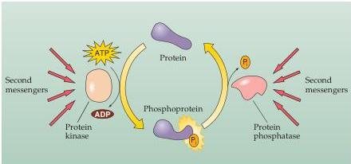

Molecular Signaling within Neurons 175

protein kinase (PKG).
These enzymes mediate many physiological responses by phosphorylating target proteins, as described in the following section.
In addition, cAMP and cGMP can bind to certain ligand-gated ion channels, thereby influencing neuronal signaling.
These cyclic nucleotide-gated channels are particularly important in phototransduction and other sensory transduction processes, such as olfaction.
Cyclic nucleotide signals are degraded by phosphodiesterases, enzymes that cleave phosphodiester bonds and convert cAMP into AMP or cGMP into GMP.

- Diacylglycerol and IP₃.
Remarkably, membrane lipids can also be converted into intracellular second messengers (Figure 7.7D).
The two most important messengers of this type are produced from phosphatidylinositol bisphosphate (PIP₂).
This lipid component is cleaved by phospholipase C, an enzyme activated by certain G-proteins and by calcium ions.
Phospholipase C splits the PIP₂ into two smaller molecules that each act as second messengers.
One of these messengers is diacylglycerol (DAG), a molecule that remains within the membrane and activates protein kinase C, which phosphorylates substrate proteins in both the plasma membrane and elsewhere.
The other messenger is inositol trisphosphate (IP₃), a molecule that leaves the cell membrane and diffuses within the cytosol.
IP₃ binds to IP₃ receptors, channels that release calcium from the endoplasmic reticulum.
Thus, the action of IP₃ is to produce yet another second messenger (perhaps a third messenger, in this case!) that triggers a whole spectrum of reactions in the cytosol.
The actions of DAG and IP₃ are terminated by enzymes that convert these two molecules into inert forms that can be recycled to produce new molecules of PIP₂.

## Second Messenger Targets: Protein Kinases and Phosphatases

As already mentioned, second messengers typically regulate neuronal functions by modulating the phosphorylation state of intracellular proteins (Figure 7.8).
Phosphorylation (the addition of phosphate groups) rapidly and reversibly changes protein function.
Proteins are phosphorylated by a wide variety of protein kinases; phosphate groups are removed by other enzymes called protein phosphatases.
The degree of phosphorylation of a target protein thus reflects a balance between the competing actions of protein kinases and phosphatases, thus integrating a host of cellular signaling pathways.
The substrates of protein kinases and phosphatases include enzymes, neurotransmitter receptors, ion channels, and structural proteins.

Figure 7.8 Regulation of cellular proteins by phosphorylation.
Protein kinases transfer phosphate groups (P₄) from ATP to serine, threonine, or tyrosine residues on substrate proteins.
This phosphorylation reversibly alters the structure and function of cellular proteins.
Removal of the phosphate groups is catalyzed by protein phosphatases.
Both kinases and phosphatases are regulated by a variety of intracellular second messengers.