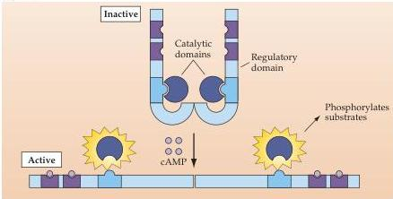
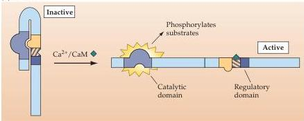
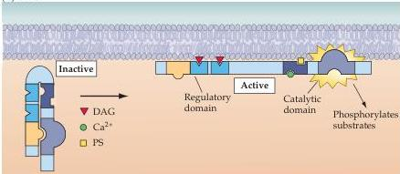

Molecular Signaling within Neurons 177

(A) PKA

(B) CaMKII

(C) PKC

kinases are particularly important for cell growth and differentiation (see Chapters 21 and 22).

- Mitogen-activated protein kinase (MAPK).
In addition to protein kinases that are directly activated by second messengers, some of these molecules can be activated by other signals, such as phosphorylation by another protein kinase.
Important examples of such protein kinases are the mitogen-activated protein kinases (MAPKs), also called extracellular signal-regulated kinases (ERKs).
MAPKs were first identified as participants in the control of cell growth and are now known to have many other signaling functions.

Figure 7.9 Mechanism of activation of protein kinases.
Protein kinases contain several specialized domains with specific functions.
Each of the kinases has homologous catalytic domains responsible for transferring phosphate groups to substrate proteins.
These catalytic domains are kept inactive by the presence of an autoinhibitory domain that occupies the catalytic site.
Binding of second messengers, such as cAMP, DAG, and $\mathrm{Ca^{2+}}$, to the appropriate regulatory domain of the kinase removes the autoinhibitory domain and allows the catalytic domain to be activated.
For some kinases, such as PKC and CaMKII, the autoinhibitory and catalytic domains are part of the same molecule.
For other kinases, such as PKA, the autoinhibitory domain is a separate subunit.