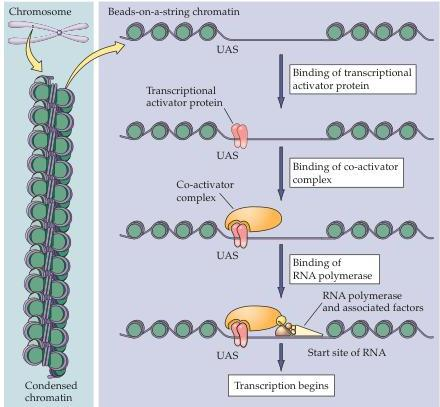

Molecular Signaling within Neurons 179

(A)
(B)
Figure 7.10 Steps involved in transcription of DNA into RNA.
Condensed chromatin (A) is decondensed into a beads-on-a-DNA-string array (B) in which an upstream activator site (UAS) is free of proteins and is bound by a sequence-specific transcriptional activator protein (transcription factor).
The transcriptional activator protein then binds co-activator complexes that enable the RNA polymerase with its associated factors to bind at the start site of transcription and initiate RNA synthesis.

with the RNA polymerase complex or by interacting with other activator proteins that influence the polymerase.

Intracellular signal transduction cascades regulate gene expression by converting transcriptional activator proteins from an inactive state to an active state in which they are able to bind to DNA.
This conversion comes about in several ways.
The key activator proteins and the mechanisms that allow them to regulate gene expression in response to signaling events are briefly summarized in the following sections.

- CREB.
The cAMP response element binding protein, usually abbreviated CREB, is a ubiquitous transcriptional activator (Figure 7.11).
CREB is normally bound to its binding site on DNA (called the cAMP response element, or CRE), either as a homodimer or bound to another, closely related transcription factor.
In unstimulated cells, CREB is not phosphorylated and has little or no transcriptional activity.
However, phosphorylation of CREB greatly potentiates transcription.
Several signaling pathways are capable of causing CREB to be phosphorylated.
Both PKA and the ras pathway, for example, can phosphorylate CREB.
CREB can also be phosphorylated in response to increased intracellular calcium, in which case the CRE site is also called the CaRE (calcium response element) site.
The calcium-dependent phosphorylation of CREB is primarily caused by $\mathrm{Ca^{2+}}$/calmodulin kinase IV (a relative of CaMKII) and by MAP kinase, which leads to prolonged CREB phosphorylation.
CREB phosphorylation must be maintained long enough for transcription to ensue, even though neuronal electrical activity only tran