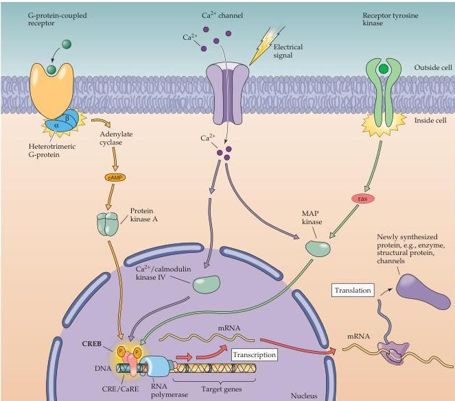

Chapter Seven

Figure 7.11 Transcriptional regulation by CREB.
Multiple signaling pathways converge by activating kinases that phosphorylate CREB.
These include PKA,  $\mathrm{Ca^{2+}}$ /calmodulin kinase IV, and MAP kinase.
Phosphorylation of CREB allows it to bind co-activators (not shown in the figure), which then stimulate RNA polymerase to begin synthesis of RNA.
RNA is then processed and exported to the cytoplasm, where it serves as mRNA for translation into protein.

siently raises intracellular calcium concentration.
Such signaling cascades can potentiate CREB-mediated transcription by inhibiting a protein phosphatase that dephosphorylates CREB.
CREB is thus an example of the convergence of multiple signaling pathways onto a single transcriptional activator.

Many genes whose transcription is regulated by CREB have been identified.
CREB-sensitive genes include the immediate early gene,  $c$ -fos (see below), the neurotrophin BDNF (see Chapter 22), the enzyme tyrosine hydroxylase (which is important for synthesis of catecholamine neurotransmitters; see Chapter 6), and many neuropeptides (including somatostatin, enkephalin, and corticotropin releasing hormone).
CREB also is thought to mediate long-lasting changes in brain function.
For example, CREB has been implicated in spatial learning, behavioral sensitization, long-term memory of odorant-conditioned behavior, and long-term synaptic plasticity (see Chapters 23 and 24).