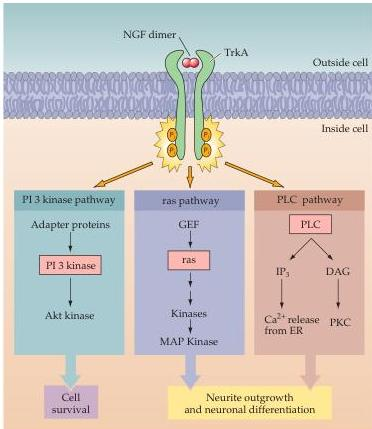

Chapter Seven

- NGF/TrkA.
The first of these is signaling by the nerve growth factor (NGF).
This protein is a member of the neurotrophin growth factor family and is required for the differentiation, survival, and synaptic connectivity of sympathetic and sensory neurons (see Chapter 22).
NGF works by binding to a high-affinity tyrosine kinase receptor, TrkA, found on the plasma membrane of these target cells (Figure 7.12).
NGF binding causes TrkA receptors to dimerize, and the intrinsic tyrosine kinase activity of each receptor then phosphorylates its partner receptor.
Phosphorylated TrkA receptors trigger the ras cascade, resulting in the activation of multiple protein kinases.
Some of these kinases translocate to the nucleus to activate transcriptional activators, such as CREB.
This ras-based component of the NGF pathway is primarily responsible for inducing and maintaining differentiation of NGF-sensitive neurons.
Phosphorylation of TrkA also causes this receptor to stimulate the activity of phospholipase C, which increases production of $\mathrm{IP}_3$ and DAG.
$\mathrm{IP}_3$ induces release of $\mathrm{Ca}^{2+}$ from the endoplasmic reticulum, and diacylglycerol activates PKC.
These two second messengers appear to target many of the same downstream effectors as ras.
Finally, activation of TrkA receptors also causes activation of other protein kinases (such as Akt kinase) that inhibit cell death.
This pathway, therefore, primarily mediates the NGF-dependent survival of sympathetic and sensory neurons described in Chapter 22.

- Long-term depression (LTD).
The interplay between several intracellular signals can be observed at the excitatory synapses that innervate Purkinje

Figure 7.12 Mechanism of action of NGF.
NGF binds to a high-affinity tyrosine kinase receptor, TrkA, on the plasma membrane to induce phosphorylation of TrkA at two different tyrosine residues.
These phosphorylated tyrosines serve to tether various adapter proteins or phospholipase C (PLC), which, in turn, activate three major signaling pathways: the PI 3 kinase pathway leading to activation of Akt kinase, the ras pathway leading to MAP kinases, and the PLC pathway leading to release of intracellular $\mathrm{Ca^{2+}}$ and activation of PKC.
The ras and PLC pathways primarily stimulate processes responsible for neuronal differentiation, while the PI 3 kinase pathway is primarily involved in cell survival.