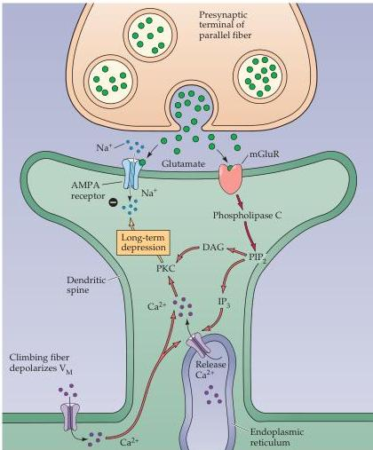

Molecular Signaling within Neurons 183

cells in the cerebellum.
These synapses are central to information flow through the cerebellar cortex, which in turn helps coordinate motor movements (see Chapter 18).
One of the synapses is between the parallel fibers (PFs) and their Purkinje cell targets.
LTD is a form of synaptic plasticity that causes the PF synapses to become less effective (see Chapter 24).
When PFs are active, they release the neurotransmitter glutamate onto the dendrites of Purkinje cells.
This activates AMPA-type receptors, which are ligand-gated ion channels (see Chapter 6), and causes a small EPSP that briefly depolarizes the Purkinje cell.
In addition to this electrical signal, PF synaptic transmission also generates two second messengers within the Purkinje cell (Figure 7.13).
The glutamate released by PFs activates metabotropic glutamate receptors, which stimulates phospholipase C to produce $\mathrm{IP}_3$ and DAG.
When the PF synapses alone are active, these intracellular signals are insufficient to open $\mathrm{IP}_3$ receptors or to stimulate PKC.

LTD is induced when PF synapses are activated at the same time as the glutamatergic climbing fiber synapses that also innervate Purkinje cells.
The climbing fiber synapses produce large EPSPs that strongly depolarize the membrane potential of the Purkinje cell.
This depolarization allows $\mathrm{Ca^{2+}}$ to

Figure 7.13 Signaling at cerebellar parallel fiber synapses.
Glutamate released by parallel fibers activates both AMPA-type and metabotropic receptors.
The latter produces $\mathrm{IP}_3$ and DAG within the Purkinje cell.
When paired with a rise in $\mathrm{Ca^{2+}}$ associated with activity of climbing fiber synapses, the $\mathrm{IP}_3$ causes $\mathrm{Ca^{2+}}$ to be released from the endoplasmic reticulum, while $\mathrm{Ca^{2+}}$ and DAG together activate protein kinase C.
These signals together change the properties of AMPA receptors to produce LTD.