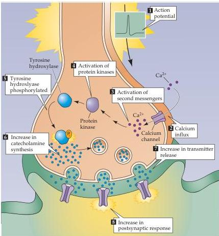

Molecular Signaling within Neurons 185

Figure 7.14 Regulation of tyrosine hydroxylase by protein phosphorylation.
This enzyme governs the synthesis of the catecholamine neurotransmitters and is stimulated by a number of intracellular signals.
In the example shown here, neuronal electrical activity (1) causes influx of $\mathrm{Ca^{2+}}$ (2).
The resultant rise in intracellular $\mathrm{Ca^{2+}}$ concentration (3) activates protein kinases (4), which phosphorylates tyrosine hydroxylase (5) to stimulate catecholamine synthesis (6).
This, in turn, increases release of catecholamines (7) and enhances the postsynaptic response produced by the synapse (8).

factors include CREB, steroid hormone receptors, and c-fos.
This plethora of molecular components allows intracellular signal transduction pathways to generate responses over a wide range of times and distances, greatly augmenting and refining the information-processing ability of neuronal circuits and ultimately systems.

# Additional Reading

## Reviews

AUGUSTINE, G.
J., F.
SANTAMARIA AND K.
TANAKA (2003) Local calcium signaling in neurons.
Neuron 40: 331-346.
DEISSEBROTH, K., P.
G.
MERMELSTEIN, H.
XIA AND R.
W.
TSIEN (2003) Signaling from synapse to nucleus: The logic behind the mechanisms.
Curr.
Opin.
Neurobiol.
13: 354-365.
EXTON, J.
H.
(1998) Small GTPases.
J.
Biol.
Chem.
273: 19923.
FISCHER, E.
H.
(1999) Cell signaling by protein tyrosine phosphorylation.
Adv.
Enzyme Regul.
Review 39: 359-369.

FRIEDMAN, W.
J.
AND L.
A.
GREENE (1999) Neurotrophin signaling via Trks and p75.
Exp.
Cell Res.
253: 131-142.
GILMAN, A.
G.
(1984) G proteins and dual control of adenylate cyclase.
Cell 36: 577-579.
GRAVES J.
D.
AND E.
G.
KREBS (1999) Protein phosphorylation and signal transduction.
Pharmacol.
Ther.
82: 111-121.
KENNEDY, M.
B.
(2000) Signal-processing machines at the postsynaptic density.
Science 290: 750-754.
KUMER, S.
AND K.
VRANA (1996) Intricate regulation of tyrosine hydroxylase activity and gene expression.
J.
Neurochem.
67: 443-462.

LEVITAN, I.
B.
(1999) Modulation of ion channels by protein phosphorylation.
How the brain works.
Adv.
Second Mess.
Phosphoprotein Res.
33: 3-22.
NEER, E.
J.
(1995) Heterotrimeric G proteins: Organizers of transmembrane signals.
Cell 80: 249-257.
RODBELL, M.
(1995) Nobel Lecture.
Signal transduction: Evolution of an idea.
Bioscience Reports 15: 117-133.
SHENG, M.
AND M.
J.
KIM (2002) Postsynaptic signaling and plasticity mechanisms.
Science 298: 776-780.
WEST, A.
E.
AND 8 OTHERS (2001) Calcium regulation of neuronal gene expression.
Proc.
Natl.
Acad.
Sci.
USA 98: 11024-11031.