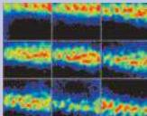

UNIT II

# SENSATION AND SENSORY PROCESSING

Surface view of the primary visual cortex illustrating patterns of neural activity visualized with intrinsic signal optical imaging techniques (see Box C in Chapter 11).
Each panel illustrates the activity evoked by viewing a single thin vertical line.
The smooth progression of the activated region from the upper left to the lower right panel illustrates the orderly mapping of visual space.
The patchy appearance of the activated region in each panel reflects the columnar mapping of orientation preference.
Red regions are the most active, black the least.
(Courtesy of Bill Bosking, Justin Crowley, Tom Tucker, and David Fitzpatrick.)

8 The Somatic Sensory System
9 Pain
10 Vision: The Eye
11 Central Visual Pathways
12 The Auditory System
13 The Vestibular System
14 The Chemical Senses

Sensation entails the ability to transduce, encode, and ultimately perceive information generated by stimuli arising from both the external and internal environments.
Much of the brain is devoted to these tasks.
Although the basic senses—somatic sensation, vision, audition, vestibular sensation, and the chemical senses—are very different from one another, a few fundamental rules govern the way the nervous system deals with each of these diverse modalities.
Highly specialized nerve cells called receptors convert the energy associated with mechanical forces, light, sound waves, odorant molecules, or ingested chemicals into neural signals—afferent sensory signals—that convey information about the stimulus to the brain.
Afferent sensory signals activate central neurons capable of representing both the qualitative and quantitative aspects of the stimulus (what it is and how strong it is) and, in some modalities (somatic sensation, vision, and audition) the location of the stimulus in space (where it is).

The clinical evaluation of patients routinely requires an assessment of the sensory systems to infer the nature and location of potential neurological problems.
Knowledge of where and how the different sensory modalities are transduced, relayed, represented, and further processed to generate appropriate behavioral responses is therefore essential to understanding and treating a wide variety of diseases.
Accordingly, these chapters on the neurobiology of sensation also introduce some of the major structure/function relationships in the sensory components of the nervous system.