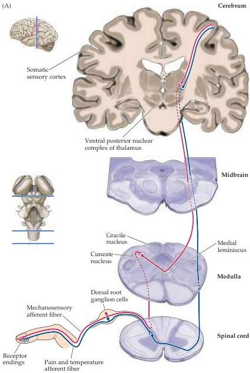
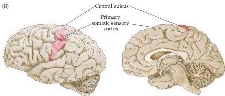

The Somatic Sensory System 191

Figure 8.1 General organization of the somatic sensory system.
(A) Mechanosensory information about the body reaches the brain by way of a three-neuron relay (shown in red).
The first synapse is made by the terminals of the centrally projecting axons of dorsal root ganglion cells onto neurons in the brainstem nuclei (the local branches involved in segmental spinal reflexes are not shown here).
The axons of these second-order neurons synapse on third-order neurons of the ventral posterior nuclear complex of the thalamus, which in turn send their axons to the primary somatic sensory cortex (red).
Information about pain and temperature takes a different course (shown in blue; the anterolateral system), and is discussed in the following chapter.
(B) Lateral and midsagittal views of the human brain, illustrating the approximate location of the primary somatic sensory cortex in the anterior parietal lobe, just posterior to the central sulcus.

