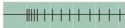
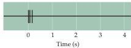

Chapter Eight

Stimulus

Slowly adapting

Rapidly adapting
Figure 8.2 Slowly adapting mechanoreceptors continue responding to a stimulus, whereas rapidly adapting receptors respond only at the onset (and often the offset) of stimulation.
These functional differences allow the mechanoreceptors to provide information about both the static (via slowly adapting receptors) and dynamic (via rapidly adapting receptors) qualities of a stimulus.

become quiescent are particularly effective in conveying information about changes in the information the receptor reports; conversely, receptors that continue to fire convey information about the persistence of a stimulus.
Accordingly, somatic sensory receptors and the neurons that give rise to them are usually classified into rapidly or slowly adapting types (see Table 8.1).
Rapidly adapting, or phasic, receptors respond maximally but briefly to stimuli; their response decreases if the stimulus is maintained.
Conversely, slowly adapting, or tonic, receptors keep firing as long as the stimulus is present.

# Mechanoreceptors Specialized to Receive Tactile Information

Four major types of encapsulated mechanoreceptors are specialized to provide information to the central nervous system about touch, pressure, vibration, and cutaneous tension: Meissner's corpuscles, Pacinian corpuscles, Merkel's disks, and Ruffini's corpuscles (Figure 8.3 and Table 8.1).
These receptors are referred to collectively as low-threshold (or high-sensitivity) mechanoreceptors because even weak mechanical stimulation of the skin induces them to produce action potentials.
All low-threshold mechanoreceptors are innervated by relatively large myelinated axons (type Aβ; see Table 8.1), ensuring the rapid central transmission of tactile information.

Meissner's corpuscles, which lie between the dermal papillae just beneath the epidermis of the fingers, palms, and soles, are elongated receptors formed by a connective tissue capsule that comprises several lamellae of Schwann cells.
The center of the capsule contains one or more afferent nerve fibers that generate rapidly adapting action potentials following minimal skin depression.
Meissner's corpuscles are the most common mechanoreceptors of "glabrous" (smooth, hairless) skin (the fingertips, for instance), and their afferent fibers account for about  $40\%$  of the sensory innervation of the human hand.
These corpuscles are particularly efficient in transducing information about the relatively low-frequency vibrations  $(30 - 50\mathrm{Hz})$  that occur when textured objects are moved across the skin.

Pacinian corpuscles are large encapsulated endings located in the subcutaneous tissue (and more deeply in interosseous membranes and mesenteries of the gut).
These receptors differ from Meissner's corpuscles in their morphology, distribution, and response threshold.
The Pacinian corpuscle has an onion-like capsule in which the inner core of membrane lamellae is separated from an outer lamella by a fluid-filled space.
One or more rapidly adapting afferent axons lie at the center of this structure.
The capsule again acts as a filter, in this case allowing only transient disturbances at high frequencies  $(250 - 350\mathrm{Hz})$  to activate the nerve endings.
Pacinian corpuscles adapt more rapidly than Meissner's corpuscles and have a lower response threshold.
These attributes suggest that Pacinian corpuscles are involved in the discrimination of fine surface textures or other moving stimuli that produce high-frequency vibration of the skin.
In corroboration of this supposition, stimulation of Pacinian corpuscle afferent fibers in humans induces a sensation of vibration or tickle.
They make up  $10 - 15\%$  of the cutaneous receptors in the hand.
Pacinian corpuscles located in interosseous membranes probably detect vibrations transmitted to the skeleton.
Structurally similar endings found in the bills of ducks and geese and in the legs of cranes and herons detect vibrations in water; such endings in the wings of soaring birds detect vibrations produced by air currents.
Because they are rapidly adapting, Pacinian corpuscles, like Meissner's corpuscles, provide information primarily about the dynamic qualities of mechanical stimuli.