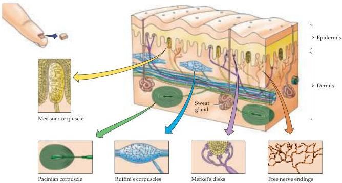

The Somatic Sensory System 193

Slowly adapting cutaneous mechanoreceptors include Merkel's disks and Ruffini's corpuscles (see Figure 8.3 and Table 8.1).
Merkel's disks are located in the epidermis, where they are precisely aligned with the papillae that lie beneath the dermal ridges.
They account for about 25% of the mechanoreceptors of the hand and are particularly dense in the fingertips, lips, and external genitalia.
The slowly adapting nerve fiber associated with each Merkel's disk enlarges into a saucer-shaped ending that is closely applied to another specialized cell containing vesicles that apparently release peptides that modulate the nerve terminal.
Selective stimulation of these receptors in humans produces a sensation of light pressure.
These several properties have led to the supposition that Merkel's disks play a major role in the static discrimination of shapes, edges, and rough textures.

Ruffini's corpuscles, although structurally similar to other tactile receptors, are not well understood.
These elongated, spindle-shaped capsular specializations are located deep in the skin, as well as in ligaments and tendons.
The long axis of the corpuscle is usually oriented parallel to the stretch lines in skin; thus, Ruffini's corpuscles are particularly sensitive to the cutaneous stretching produced by digit or limb movements.
They account for about 20% of the receptors in the human hand and do not elicit any particular tactile sensation when stimulated electrically.
Although there is still some question as to their function, they probably respond primarily to internally generated stimuli (see the section on proprioception, below).

## Differences in Mechanosensory Discrimination across the Body Surface

The accuracy with which tactile stimuli can be sensed varies from one region of the body to another, a phenomenon that illustrates some further principles

Figure 8.3 The skin harbors a variety of morphologically distinct mechanoreceptors.
This diagram represents the smooth, hairless (also called glabrous) skin of the fingertip.
The major characteristics of the various receptor types are summarized in Table 8.1.
(After Darian-Smith, 1984.)