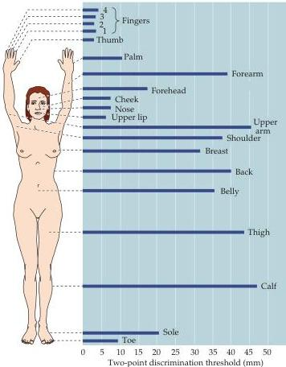

Chapter Eight

Figure 8.4 Variation in the sensitivity of tactile discrimination as a function of location on the body surface, measured here by two-point discrimination.
(After Weinstein, 1968.)

of somatic sensation.
Figure 8.4 shows the results of an experiment in which variation in tactile ability across the body surface was measured by two-point discrimination.
This technique measures the minimal interstimulus distance required to perceive two simultaneously applied stimuli as distinct (the indentations of the points of a pair of calipers, for example).
When applied to the skin, such stimuli of the fingertips are discretely perceived if they are only 2 mm apart.
In contrast, the same stimuli applied to the forearm are not perceived as distinct until they are at least 40 mm apart! This marked regional difference in tactile ability is explained by the fact that the encapsulated mechanoreceptors that respond to the stimuli are three to four times more numerous in the fingertips than in other areas of the hand, and many times more dense than in the forearm.
Equally important in this regional difference are the sizes of the neuronal receptive fields.
The receptive field of a somatic sensory neuron is the region of the skin within which a tactile stimulus evokes a sensory response in the cell or its axon (Boxes A and B).
Analysis of the human hand shows that the receptive fields of mechanosensory neurons are 1–2 mm in diameter on the fingertips but 5–10 mm on the palms.
The receptive fields on the arm are larger still.
The importance of receptive field size is easy to envision.
If, for instance, the receptive fields of all cutaneous receptor neurons covered the entire digital pad, it would be impossible to discriminate two spatially separate stimuli applied to the fingertip (since all the receptive fields would be returning the same spatial information).