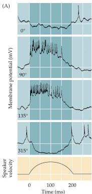
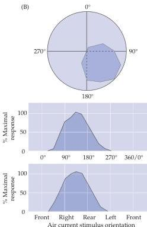

The Somatic Sensory System 195

# Box A

## Receptive Fields and Sensory Maps in the Cricket

Two principles of somatiosensory organization have emerged from studies of the mammalian brain: (1) individual neurons are tuned to particular aspects of complex stimuli; and (2) these stimulus qualities are represented in an orderly fashion in relevant regions of the nervous system.
These principles apply equally well to invertebrates, including the equivalent of the somatic sensory system in insects such as crickets, grasshoppers, and cockroaches.

In the cricket, the salient tactile stimulation for the animal comes from air currents that displace sensory hairs of bilaterally symmetric sensory structures called cerci (sing.
cercus).
The location and structure of specific cercal hairs allow them to be displaced by air currents having different directions and speeds (Figure A).
Accordingly, the peripheral sensory neurons associated with the hairs represent the full range of air current directions and velocities impinging on the animal.
This information is carried centrally and is systematically represented in a region of the cricket central nervous system called the terminal ganglion.

Individual neurons in this ganglion correspond to the cercal hairs, and have receptive fields and response properties that represent a full range of directions and speeds for extrinsic mechanical forces, including air currents (Figure B).
For the cricket, the significance of this information is, among other things, detecting the direction and speed of oncoming objects to then execute motor programs for escape.
(This is also the likely significance of this representation for cockroaches, which can therefore escape the consequences of a descending human foot.)

Much like the somatic sensory system in mammals, the primary sensory afferents project to the terminal ganglion in an orderly fashion, such that there is a somatotopic map of air current directions.
And, like mammals, individual neurons within this representation are tuned to specific aspects of the mechanical forces acting on the cricket.

These facts about insects' mechanosensory system emphasize that somatic sensory functions are basically similar across a wide range of animals.
Indeed, regardless of sensory modality, nervous system organization, or the identity of the organism, it is likely that stimulus specificity will be reflected in receptive fields of individual neurons and there will be orderly mapping of those receptive fields into either a topographic or computational map in the animal's brain.

(A) Intracellular recording of action potential activity of an individual sensory neuron's responses to different directions of wind current.
(B) The plots indicate this neuron's receptive field for wind direction (top) and the tuning curve for the neuron's selective firing to its preferred direction.
(After Miller et al., 1991.)

## References

JACOBS, G.
A.
AND F.
E.
THEUNISSEN (1996) Functional organization of a neural map in the cricket cercal sensory system.
J.
Neurosci.
16: 769-784.

MILLER, J.
P., G.
A.
JACOBS AND F.
E.
THEUNISSEN (1991) Representation of sensory information in the cricket cercal sensory system.
I.
Response properties of the primary interneurons.
J.
Neurophys.
66: 1680-1688.

MURPHEY, R.
K.
(1981) The structure and development of somatotopic map in crickets: The cercal afferent projection.
Dev.
Biol.
88: 236-246.

MURPHEY, R.
K.
AND H.
V.
B.
HIRSCH (1982) From cat to cricket: The genesis of response selectivity of interneurons.
Curr.
Topics Dev.
Biol.
17: 241-256.