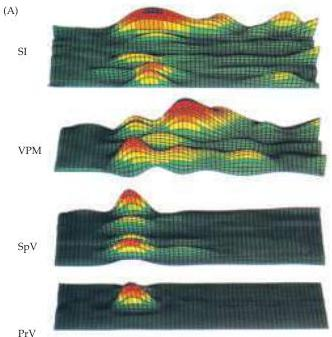

Chapter Eight

# Box B

## Dynamic Aspects of Somatic Sensory Receptive Fields

When humans explore objects with their hands, multiple contacts between the skin and the object surface generate extraordinarily complex patterns of tactile stimuli.
As a consequence, the somatic sensory system must process signals that change continuously in time.
Nonetheless, we routinely discriminate the size, texture and shape of objects with great accuracy.
Until recently, the temporal structure of such stimuli was not considered a major variable in characterizing the physiological properties of somatic sensory neurons.
For instance, the classical definition of the receptive field of a somatic sensory neuron takes into account only the overall area of the body surface that elicits significant variation in the neuron's firing rate.
By the same token, the topographic maps in the somatic sensory system have been interpreted as evidence that tactile information processing involves primarily spatial criteria.

The advent of multiple electrode recording to simultaneously monitor the activity of large populations of single neurons has begun to change this "static" view of the somatic sensory system.
In both primates and rodents, this approach has shown that the receptive fields of cortical and subcortical neurons

(A) Simultaneous electrode recordings in behaving rats allow monitoring of the spatiotemporal spread of neuronal activation across several levels of the somatic sensory system following stimulation (of a single facial whisker, in this example).
These 3-D graphs represent patterns of neuronal ensemble activity at each level of the pathway.
The $x$ axis represents the poststimulus time in ms, the $y$ axis the number of neurons recorded at each level; the color-coded gradient in the $z$ axis shows the response of the neurons, with red the highest firing and green the lowest.
SI, somatic sensory cortex; VPM, ventral posterior medial nucleus of the thalamus; SpV, spinal nucleus of the trigeminal brainstem complex; PrV, principal nucleus of the brainstem trigeminal complex.
(From Nicholelis et al., 1997.)

Receptor density and receptive field sizes in different regions are not the only factors determining somatic sensation.
Psychophysical analysis of tactile performance suggests that something more than the cutaneous periphery is needed to explain variations in tactile perception.
For instance, sensory thresholds in two-point discrimination tests vary with practice, fatigue, and stress.
The contextual significance of stimuli is also important in determining what we actually feel; even though we spend most of the day wearing clothes, we usually ignore the tactile stimulation that they produce.
Some aspect of the mechanosensory system allows us to filter out this information and pay attention to it only when necessary.
The fascinating phenomenon of "phantom limb" sensations after amputation (see Box C in Chapter 9) provides further evidence that tactile perception is not fully explained by the