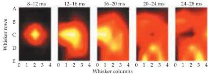
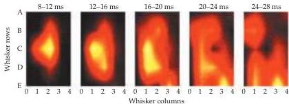

The Somatic Sensory System 197

(B)

(B) Receptive fields of two cortical neurons from two different animals.
Each panel represents the matrix of whiskers on the animals' snout (whisker columns are on the $x$ axis and whisker rows on the $y$ axis) for a 4-ms epoch of poststimulus time.
Within a particular time period, the center of the receptive field is defined as the whisker eliciting the greatest response magnitude (yellow).
Note that the receptive field centers shift as a function of time.
(From Ghazanfar and Nicholelis, 1998.)

vary as a function of time: The neuron responds differently to a spatially defined stimulus as the period of stimulation proceeds (see Figures A and B).

This coupling of space and time can also be demonstrated at level of somatotopic maps.
By recording the activity of single neurons located in different regions of the map simultaneously, it is apparent that the stimulation of a small area of the skin tends to excite more and more neurons as time goes by.
Thus, many more neurons than those located in the area of the map directly representing the stimulated skin actually respond to the stimulus, albeit at longer latencies.

The end result of these more complex neuronal responses is the emergence of spatiotemporal representations at all levels of the somatic sensory system.
Thus, contrary to the classical notion of receptive fields, the somatic sensory system processes information in a dynamic way.
Such processing is not only relevant for the normal operation of the system, but may also account for some aspects of adult plasticity (see Chapter 24).

## References

GHAZANFAR, A.
A.
AND M.
A.
L.
NICOLELIS (1999) Spatiotemporal properties of layer V neurons of the rat primary somatosensory cortex.
Cereb.
Cortex 4: 348-361.

NICOLELIS, M.
A.
L., A.
A.
GHAZANFAR, B.
FAGGIN, S.
VOTAW AND L.
M.
O.
OLIVEIRA (1997) Reconstructing the engram: Simultaneous, multiple site, many single neuron recordings.
Neuron 18: 529-537.

NICOLELIS, M.
A.
L.
AND 7 OTHERS (1998) Simultaneous encoding of tactile information by three primate cortical areas.
Nature Neurosci.
1: 621-630.

peripheral information that travels centrally.
The central nervous system clearly plays an active role in determining the perception of the mechanical forces that act on us.

## Mechanoreceptors Specialized for Proprioception

Whereas cutaneous mechanoreceptors provide information derived from external stimuli, another major class of receptors provides information about mechanical forces arising from the body itself, the musculoskeletal system in particular.
These are called proprioceptors, roughly meaning "receptors for self." The purpose of proprioceptors is primarily to give detailed and continuous information about the position of the limbs and other body parts in