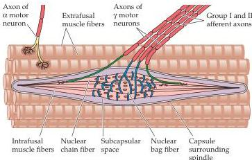

Chapter Eight

space (specialized mechanoreceptors also exist in the heart and major vessels to provide information about blood pressure, but these neurons are considered to be part of the visceral motor system; see Chapter 20).
Low-threshold mechanoreceptors, including muscle spindles, Golgi tendon organs, and joint receptors, provide this kind of sensory information, which is essential to the accurate performance of complex movements.
Information about the position and motion of the head is particularly important; in this case, proprioceptors are integrated with the highly specialized vestibular system, which is considered separately in Chapter 13.

The most detailed knowledge about proprioception derives from studies of muscle spindles, which are found in all but a few striated (skeletal) muscles.
Muscle spindles consist of four to eight specialized intrafusal muscle fibers surrounded by a capsule of connective tissue.
The intrafusal fibers are distributed among the ordinary (extrafusal) fibers of skeletal muscle in a parallel arrangement (Figure 8.5).
In the largest of the several intrafusal fibers, the nuclei are collected in an expanded region in the center of the fiber called a bag; hence the name nuclear bag fibers.
The nuclei in the remaining two to six smaller intrafusal fibers are lined up single file, with the result that these fibers are called nuclear chain fibers.
Myelinated sensory axons belonging to group Ia innervate muscle spindles by encircling the middle portion of both types of intrafusal fibers (see Figure 8.5 and Table 8.1).
The Ia axon terminal is known as the primary sensory ending of the spindle.
Secondary innervation is provided by group II axons that innervate the nuclear chain fibers and give off a minor branch to the nuclear bag fibers.
The intrafusal muscle fibers contract when commanded to do so by motor axons derived from a pool of specialized motor neurons in the spinal cord (called  $\gamma$  motor neurons).
The major function of muscle spindles is to provide information about muscle length (that is, the degree to which they are being stretched).
A detailed account of how these important receptors function during movement is given in Chapters 15 and 16.

The density of spindles in human muscles varies.
Large muscles that generate coarse movements have relatively few spindles; in contrast, extraocular muscles and the intrinsic muscles of the hand and neck are richly supplied with spindles, reflecting the importance of accurate eye movements, the need to manipulate objects with great finesse, and the continuous demand for precise positioning of the head.
This relationship between receptor den

Figure 8.5 A muscle spindle and several extrafusal muscle fibers.
See text for description.
(After Matthews, 1964.)