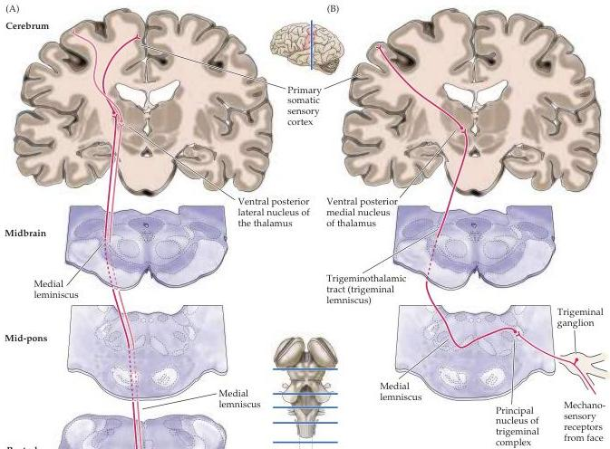
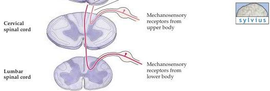

The Somatic Sensory System

Figure 8.6 Schematic representation of the main mechanosensory pathways.
(A) The dorsal column-medial lemniscus pathway carries mechanosensory information from the posterior third of the head and the rest of the body.
(B) The trigeminal portion of the mechanosensory system carries similar information from the face.

