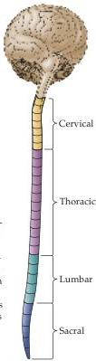
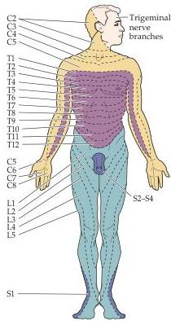
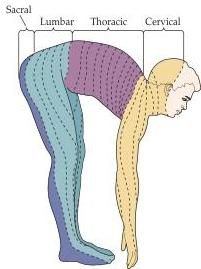

Chapter Eight

# Box C Dermatomes

The innervation arising from a single dorsal root ganglion and its spinal nerve is called a dermatome.
The full set of sensory dermatomes is shown here for a typical adult.
Knowledge of this arrangement is particularly important in defining the location of suspected spinal (and other) lesions.
The numbers refer to the spinal segments by which each nerve is named.
(After Rosenzweig et al., 2002.)

Each dorsal root (or sensory) ganglion and associated spinal nerve arises from an iterated series of embryonic tissue masses called somites.
This fact of development explains the overall segmental arrangement of somatic nerves (and the targets they innervate) in the adult (see figure).
The territory innervated by each spinal nerve is called a dermatome.
In humans, the cutaneous area of each dermatome has been defined in patients in whom specific dorsal roots were affected

(as in herpes zoster, or "shingles") or after surgical interruption (for relief of pain or other reasons).
Such studies show that dermatomal maps vary among individuals.
Moreover, dermatomes overlap substantially, so that injury to an individual dorsal root does not lead to complete loss of sensation in the relevant skin region, the overlap being more extensive for touch, pressure, and vibration than for pain and temperature.
Thus, testing for pain sensation provides

a more precise assessment of a segmental nerve injury than does testing for responses to touch, pressure, or vibration.
Finally, the segmental distribution of proprioceptors does not follow the dermatomal map but is more closely allied with the pattern of muscle innervation.
Despite these limitations, knowledge of dermatomes is essential in the clinical evaluation of neurological patients, particularly in determining the level of a spinal lesion.

niscus thus reach the ventral posterior lateral (VPL) nucleus of the thalamus, whose cells are the third-order neurons of the dorsal column-medial lemniscus system (see Figure 8.7).

# The Trigeminal Portion of the Mechanosensory System

As noted, the dorsal column-medial lemniscus pathway described in the preceding section carries somatic information from only the upper and lower body and from the posterior third of the head.
Tactile and propriocep