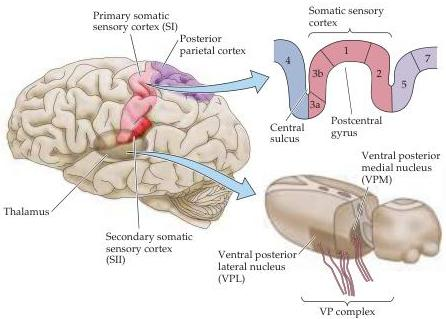

Chapter Eight

Figure 8.7 Diagram of the somatic sensory portions of the thalamus and their cortical targets in the postcentral gyrus.
The ventral posterior nuclear complex comprises the VPM, which relays somatic sensory information carried by the trigeminal system from the face, and the VPL, which relays somatic sensory information from the rest of the body.
Inset above shows organization of the primary somatosensory cortex in the postcentral gyrus, shown here in a section cutting across the gyrus from anterior to posterior.
(After Brodal, 1992, and Jones et al., 1982.)

of these four cortical areas contains a separate and complete representation of the body.
In these somatotopic maps, the foot, leg, trunk, forelimbs, and face are represented in a medial to lateral arrangement, as shown in Figures 8.8A,B and 8.9.

Although the topographic organization of the several somatic sensory areas is similar, the functional properties of the neurons in each region and their organization are distinct (Box D).
For instance, the neuronal receptive fields are relatively simple in area 3b; the responses elicited in this region are generally to stimulation of a single finger.
In areas 1 and 2, however, the majority of the receptive fields respond to stimulation of multiple fingers.
Furthermore, neurons in area 1 respond preferentially to particular directions of skin stimulation, whereas many area 2 neurons require complex stimuli to activate them (such as a particular shape).
Lesions restricted to area 3b produce a severe deficit in both texture and shape discrimination.
In contrast, damage confined to area 1 affects the ability of monkeys to perform accurate texture discrimination.
Area 2 lesions tend to produce deficits in finger coordination, and in shape and size discrimination.

A salient feature of cortical maps, recognized soon after their discovery, is their failure to represent the body in actual proportion.
When neurosurgeons determined the representation of the human body in the primary sensory (and motor) cortex, the homunculus (literally, "little man") defined by such mapping procedures had a grossly enlarged face and hands compared to the torso and proximal limbs (Figure 8.8C).
These anomalies arise because