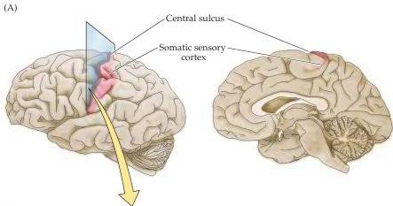
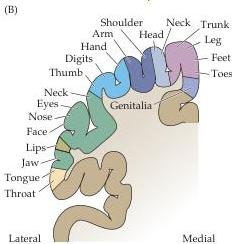
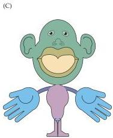

The Somatic Sensory System 205

Figure 8.8 Somatotopic order in the human primary somatic sensory cortex.
(A) Diagram showing the region of the human cortex from which electrical activity is recorded following mechanosensory stimulation of different parts of the body.
The patients in the study were undergoing neurosurgical procedures for which such mapping was required.
Although modern imaging methods are now refining these classical data, the human somatotopic map first defined in the 1930s has remained generally valid.
(B) Diagram along the plane in (A) showing the somatotopic representation of body parts from medial to lateral.
(C) Cartoon of the homunculus constructed on the basis of such mapping.
Note that the amount of somatic sensory cortex devoted to the hands and face is much larger than the relative amount of body surface in these regions.
A similar disproportion is apparent in the primary motor cortex, for much the same reasons (see Chapter 17).
(After Penfield and Rasmussen, 1950, and Corsi, 1991.)

manipulation, facial expression, and speaking are extraordinarily important for humans, requiring more central (and peripheral) circuitry to govern them.
Thus, in humans, the cervical spinal cord is enlarged to accommodate the extra circuitry related to the hand and upper limb, and as stated earlier, the density of receptors is greater in regions such as the hands and lips.
Such distortions are also apparent when topographical maps are compared across species.
In the rat brain, for example, an inordinate amount of the somatic sensory cortex is devoted to representing the large facial whiskers that pro