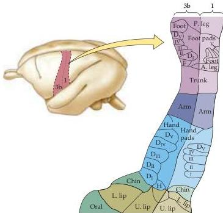

Chapter Eight

Figure 8.9 The primary somatic sensory map in the owl monkey based, as in Figure 8.8, on the electrical responsiveness of the cortex to peripheral stimulation.
Much more detailed mapping is possible in experimental animals than in neurosurgical patients.
The enlargement on the right shows areas 3b and 1, which process most cutaneous mechanosensory information.
The arrangement is generally similar to that determined in humans.
(After Kaas, 1983.)

vide a key component of the somatic sensory input for rats and mice (see Boxes B and D), while raccoons overrepresent their paws and the platypus its bill.
In short, the sensory input (or motor output) that is particularly significant to a given species gets relatively more cortical representation.

## Higher-Order Cortical Representations

Somatic sensory information is distributed from the primary somatic sensory cortex to "higher-order" cortical fields (as well as to subcortical structures).
One of these higher-order cortical centers, the secondary somatosensory cortex (sometimes called SII and adjacent to the primary cortex; see Figure 8.7), receives convergent projections from the primary somatic sensory cortex and sends projections in turn to limbic structures such as the amygdala and hippocampus (see Chapters 28 and 30).
This latter pathway is believed to play an important role in tactile learning and memory.
Neurons in motor cortical areas in the frontal lobe also receive tactile information from the anterior parietal cortex and, in turn, provide feedback projections to several cortical somatic sensory regions.
Such integration of sensory and motor information is considered in Chapters 19 and 25, where the role of these "association" regions of the cerebral cortex are discussed in more detail.

Finally, a fundamental but often neglected feature of the somatic sensory system is the presence of massive descending projections.
These pathways originate in sensory cortical fields and run to the thalamus, brainstem, and spinal cord.
Indeed, descending projections from the somatic sensory cortex outnumber ascending somatic sensory pathways! Although their physiological role is not well understood, it is generally assumed (with some experimental support) that descending projections modulate the ascending flow of sensory information at the level of the thalamus and brainstem.