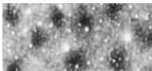
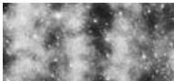
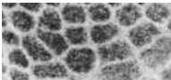
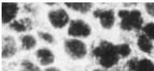
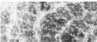

The Somatic Sensory System 207

# Box D

## Patterns of Organization within the Sensory Cortices: Brain Modules

Observations over the last 40 years have made it clear that there is an iterated substructure within the somatic sensory (and many other) cortical maps.
This substructure takes the form of units called modules, each involving hundreds or thousands of nerve cells in repeating patterns.
The advantages of these iterated patterns for brain function remain largely mysterious; for the neurobiologist, however, such iterated arrangements have provided important clues about cortical connectivity and the mechanisms by which neural activity influences brain development (see Chapters 22 and 23).

The observation that the somatic sensory cortex comprises elementary units of vertically linked cells was first noted in the 1920s by the Spanish neuroanatomist Rafael Lorente de No, based on his studies in the rat.
The potential importance of cortical modularity remained largely unexplored until the 1950s, however, when electrophysiological experiments indicated an arrangement of repeating units in the brains of cats and, later, monkeys.
Vernon Mountcastle, a neurophysiologist at Johns Hopkins, found that vertical microelectrode penetrations in the primary somatosensory cortex of these animals encountered cells that responded to the same sort of mechanical stimulus presented at the same location on the body surface.
Soon after Mountcastle's pioneering work, David Hubel and Torsten Wiesel discovered a similar arrangement in the cat primary visual cortex.
These and other observations led Mountcastle to the general view that "the elementary pattern of organization of the cerebral cortex is a vertically oriented column or cylinder of cells capable of input-output functions of considerable complexity." Since these discoveries in the late 1950s and early 1960s, the view that modular circuits represent a fundamental feature of the mammalian cerebral cortex has gained wide acceptance, and many such entities

have now been described in various cortical regions (see figure).

This wealth of evidence for such patterned circuits has led many neuroscientists to conclude, like Mountcastle, that modules are a fundamental feature of the cerebral cortex, essential for perception, cognition, and perhaps even consciousness.
Despite the prevalence of iterated modules, there are some problems with the view that modular units are universally important in cortical function.
First, although modular circuits of a given class are readily seen in the brains of some species, they have not been found in the same brain regions of other, sometimes closely related, animals.
Second, not all regions of the mammalian cortex are organized in a modular fashion.
And third, no clear function of such modules has been discerned, much effort and speculation notwithstanding.
This salient feature of the organization of the somatic sensory cortex and other cortical (and some subcortical) regions therefore remains a tantalizing puzzle.

## References

HUBEL, D.
H.
(1988) Eye, Brain, and Vision.
Scientific American Library.
New York: W.
H.
Freeman.
LORENTE DE NO, R.
(1949) The structure of the cerebral cortex.
Physiology of the Nervous System, 3rd Ed.
New York: Oxford University Press.
MOUNTCASTLE, V.
B.
(1957) Modality and topographic properties of single neurons of cat's somatic sensory cortex.
J.
Neurophysiol.
20: 408-434.
MOUNTCASTLE, V.
B.
(1998) Perceptual Neuroscience: The Cerebral Cortex.
Cambridge: Harvard University Press.
PURVES, D., D.
RIDDLE AND A.
LAMANTIA (1992) Iterated patterns of brain circuitry (or how the cortex gets its spots).
Trends Neurosci.
15: 362-368.
WOOLSEY, T.
A.
AND H.
VAN DER LOOS (1970) The structural organization of layer IV in the somatosensory region (SI) of mouse cerebral cortex.
The description of a cortical field composed of discrete cytoarchitectonic units.
Brain Res.
17: 205-242.

(A)

(B)

(C)

(D)

(E)

(F)

Examples of iterated, modular substructures in the mammalian brain.
(A) Ocular dominance columns in layer IV in the primary visual cortex (V1) of a rhesus monkey.
(B) Repeating units called "blobs" in layers II and III in V1 of a squirrel monkey.
(C) Stripes in layers II and III in V2 of a squirrel monkey.
(D) Barrels in layer IV in primary somatic sensory cortex of a rat.
(E) Glomeruli in the olfactory bulb of a mouse.
(F) Iterated units called "barreloids" in the thalamus of a rat.
These and other examples indicate that modular organization is commonplace in the brain.
These units are on the order of one hundred to several hundred microns across.
(From Purves et al., 1992.)