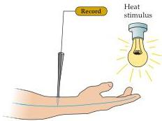
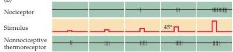
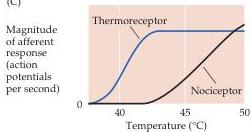

Chapter Nine

(A)

(B)

(C)
Figure 9.1 Experimental demonstration that nociception involves specialized neurons, not simply greater discharge of the neurons that respond to normal stimulus intensities.
(A) Arrangement for transcutaneous nerve recording.
(B) In the painful stimulus range, the axons of thermoreceptors fire action potentials at the same rate as at lower temperatures; the number and frequency of action potential discharge in the nociceptive axon, however, continues to increase.
(Note that  $45^{\circ}\mathrm{C}$  is the approximate threshold for pain.) (C) Summary of results.
(After Fields, 1987.)

therefore said to be polymodal.
In short, there are three major classes of nociceptors in the skin: Aδ mechanosensitive nociceptors; Aδ mechanothermal nociceptors; and polymodal nociceptors, the latter being specifically associated with C fibers.
The receptive fields of all pain-sensitive neurons are relatively large, particularly at the level of the thalamus and cortex, presumably because the detection of pain is more important than its precise localization.

Studies carried out in both humans and experimental animals demonstrated some time ago that the rapidly conducting axons that subserve somatic sensory sensation are not involved in the transmission of pain.
A typical experiment of this sort is illustrated in Figure 9.1.
The peripheral axons responsive to nonpainful mechanical or thermal stimuli do not discharge at a greater rate when painful stimuli are delivered to the same region of the skin surface.
The nociceptive axons, on the other hand, begin to discharge only when the strength of the stimulus (a thermal stimulus in the example in Figure 9.1) reaches high levels; at this same stimulus intensity, other thermoreceptors discharge at a rate no different from the maximum rate already achieved within the nonpainful temperature range, indicating that there are both nociceptive and nonnociceptive thermoreceptors.
Equally important, direct stimulation of the large-diameter somatic sensory afferents at any frequency in humans does not produce sensations that are described as painful.
In contrast, the smaller-diameter, more slowly conducting Aδ and C fibers are active when painful stimuli are delivered; and when stimulated electrically in human subjects, they produce pain.

How, then, do these different classes of nociceptors lead to the perception of pain? As mentioned, one way of determining the answer has been to stimulate different nociceptors in human volunteers while noting the sensations reported.
In general, two categories of pain perception have been described: a sharp first pain and a more delayed, diffuse, and longer-lasting sensation that is generally called second pain (Figure 9.2A).
Stimulation of the large, rapidly conducting  $\mathrm{A}\alpha$  and  $\mathrm{A}\beta$  axons in peripheral nerves does not elicit the sensation of pain.
When the stimulus intensity is raised to a level that activates a subset of  $\mathrm{A}\delta$  fibers, however, a tingling sensation or, if the stimulation is intense enough, a feeling of sharp pain is reported.
If the stimulus intensity is increased still further, so that the small-diameter, slowly conducting C fiber axons are brought into play, then a duller, longer-lasting