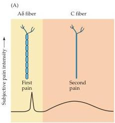
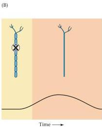
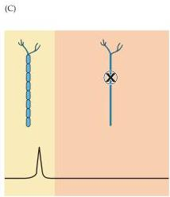

Pain 211

Figure 9.2 Pain can be separated into an early perception of sharp pain and a later sensation that is described as having a duller, burning quality.
(A) First and second pain, as these sensations are called, are carried by different axons, as can be shown by (B) the selective blockade of the more rapidly conducting myelinated axons that carry the sensation of first pain, or (C) blockade of the more slowly conducting C fibers that carry the sensation of second pain.
(After Fields, 1990.)

sensation of pain is experienced.
It is also possible to selectively anesthetize C fibers and Aδ fibers; in general, these selective blocking experiments confirm that the Aδ fibers are responsible for first pain, and that C fibers are responsible for the duller, longer-lasting second pain (Figure 9.2B,C).

## Transduction of Nociceptive Signals

Given the variety of stimuli (mechanical, thermal, and chemical) that can give rise to painful sensations, the transduction of nociceptive signals is a complex task.
While many puzzles remain, some insights have come from the identification of specific receptors associated with nociceptive afferent endings.
These receptors are sensitive to both heat and to capsaicin, the ingredient in chili peppers that is responsible for the familiar tingling or burning sensation produced by spicy foods (Box A).
The so-called vanilloid receptor (VR-1 or TRPV1) is found in C and Aδ fibers and is activated by moderate heat (45°C—a temperature that is perceived as uncomfortable) as well as by capsaicin.
Another type of receptor (vanilloid-like receptor, VRL-1 or TRPV2) has a higher threshold response to heat (52°C), is not sensitive to capsaicin, and is found in Aδ fibers.
Both are members of the larger family of transient receptor potential (TRP) channels, first identified in studies of the phototransduction pathway in fruit flies and now known to comprise a large number of receptors sensitive to different ranges of heat and cold.
Structurally, TRP channels resemble voltage-gated potassium or cyclic nucleotide-gated channels, having six transmembrane domains with a pore between domains 5 and 6.
Under resting conditions the pore of the channel is closed.
In the open, activated state, these receptors allow an influx of sodium and calcium that initiates the generation of action potentials in the nociceptive fibers.

Since the same receptor is responsive to heat as well as capsaicin, it is not surprising that chili peppers seem "hot." A puzzle, however, is why the nervous system has evolved receptors that are sensitive to a chemical in chili peppers.
As with the case of other plant compounds that selectively activate neural receptors (see the discussion of opiates below), it seems likely that TRPV1 receptors detect endogenous substances whose chemical structure resembles that of capsaicin.
In fact, there is now some evidence that 'endovanilloids' that are produced by peripheral tissues in response to injury,