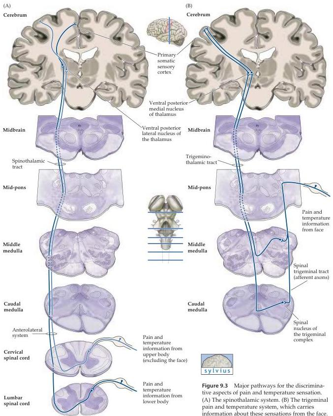

Chapter Nine

Figure 9.3 Major pathways for the discriminative aspects of pain and temperature sensation.
(A) The spinothalamic system.
(B) The trigeminal pain and temperature system, which carries information about these sensations from the face.