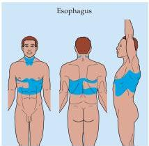
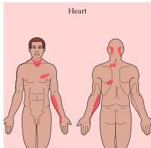
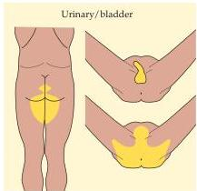
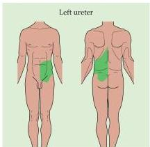
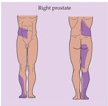

Pain 215

# Box B

## Referred Pain

Surprisingly, there are few, if any, neurons in the dorsal horn of the spinal cord that are specialized solely for the transmission of visceral pain.
Obviously, we recognize such pain, but it is conveyed centrally via dorsal horn neurons that are also concerned with cutaneous pain.
As a result of this economical arrangement, the disorder of an internal organ is sometimes perceived as cutaneous pain.
A patient may therefore present to the physician with the complaint of pain at a site other than its actual source, a potentially confusing phenomenon called referred pain.
The most common clinical example is anginal pain (pain arising from heart muscle that is not being adequately perfused with blood) referred to the upper chest wall, with radiation into the left arm and hand.
Other important examples are gallbladder pain referred to the scapular region, esophageal pain referred to the chest wall, ureteral pain (e.g., from passing a kidney stone) referred to the lower abdominal wall, bladder pain referred to the perineum, and the pain from an inflamed appendix referred to the anterior abdominal wall around the umbilicus.
Understanding referred pain can lead to an astute diagnosis that might otherwise be missed.

## References

CAPPS, J.
A.
AND G.
H.
COLEMAN (1932) An Experimental and Clinical Study of Pain in the Pleura, Pericardium, and Peritoneum.
New York: Macmillan.

HEAD, H.
(1893) On disturbances of sensation with special reference to the pain of visceral disease.
Brain 16: 1–32.

KELLGREW, J.
H.
(1939–1942) On the distribution of pain arising from deep somatic structures with charts of segmental pain areas.
Clin.
Sci.
4: 35–46.

Examples of pain arising from a visceral disorder referred to a cutaneous region (color).

