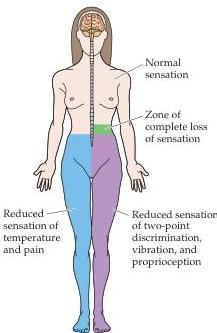

Chapter Nine

Figure 9.4 Pattern of "dissociated" sensory loss following a spinal cord hemisection at the 10th thoracic level on the left side.
This pattern, together with motor weakness on the same side as the lesion, is sometimes referred to as Brown-Sequard syndrome.

entering the pons, these small myelinated and unmyelinated trigeminal fibers descend to the medulla, forming the spinal trigeminal tract (or spinal tract of cranial nerve V), and terminate in two subdivisions of the spinal trigeminal complex: the pars interpolaris and pars caudalis.
Axons from the second-order neurons in these two trigeminal nuclei, like their counterparts in the spinal cord, cross the midline and ascend to the contralateral thalamus in the trigeminothalamic tract.

The principal target of the spinothalamic and trigeminothalamic pathway is the ventral posterior nucleus of the thalamus.
Similar to the organization of the mechanosensory pathways, information from the body terminates in the VPL, while information from the face terminate in the VPM.
These nuclei send their axons to primary and secondary somatosensory cortex.
The nociceptive information transmitted to these cortical areas is thought to be responsible for the discriminative component of pain: identifying the location, the intensity, and quality of the stimulation.
Consistent with this interpretation, electrophysiological recordings from nociceptive neurons in S1, show that these neurons have small localized receptive fields, properties commensurate with behavioral measures of pain localization.

The affective-motivational aspect of pain is evidently mediated by separate projections of the anterolateral system to the reticular formation of the midbrain (in particular the parabrachial nucleus), and to thalamic nuclei that lie medial to the ventral posterior nucleus (including the so-called intralaminar nuclei; see Figure 9.5).
Studies in rodents show that neurons in the parabrachial nucleus respond to most types of noxious stimuli, and have large receptive fields that can include the whole surface of the body.
Neurons in the parabrachial nucleus project in turn to the hypothalamus and the amygdala, thus providing nociceptive information to circuits known to be concerned with motivation and affect (see Chapter 28).
These parabrachial targets are also the source of projections to the periaqueductal grey of the midbrain, a structure that plays an important role in the descending control of activity in the pain pathway.
Nociceptive inputs to the parabrachial nucleus and to the ventral posterior nucleus arise from separate populations of neurons in the dorsal horn of the spinal cord.
Parabrachial inputs arise from neurons in the most superficial part of the dorsal horn (lamina I), while ventral posterior inputs arise from deeper parts of the dorsal horn (e.g., lamina V).
By taking advantage of the unique molecular signature of these two sets of neurons, it has been possible to selectively eliminate the nociceptive inputs to the parabrachial nucleus in rodents.
In these animals, the behavioral responses to the presentation of noxious stimulation (capsaicin, for example) are substantially attenuated.

Projections from the anterolateral system to the medial thalamic nuclei provide nociceptive signals to areas in the frontal lobe, the insula and the cingulate cortex (Figure 9.5).
In accord with this anatomy, functional imaging studies in humans have shown a strong correlation between activity in the anterior cingulate cortex and the experience of a painful stimulus.
Moreover, experiments using hypnosis have been able to tease apart the neural response to changes in the intensity of a painful stimulus from changes in its unpleasantness.
Changes in intensity are accompanied by changes in the activity of neurons in somatosensory cortex, with little change in the activity of cingulate cortex, whereas changes in unpleasantness are correlated with changes in the activity of neurons in cingulate cortex.

From this description, it should be evident that the full experience of pain involves the cooperative action of an extensive network of brain regions whose properties are only beginning to be understood (Box C).
The cortical