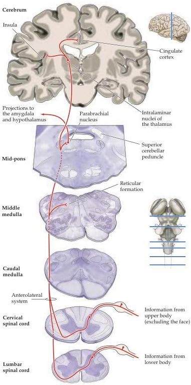

Pain

Figure 9.5 Affective-motivational pain pathways.
Nociceptive information critical for signaling the unpleasant quality of pain is mediated by projections to the reticular formation (including the parabrachial nucleus) and to the intralaminar nuclei of the thalamus.

