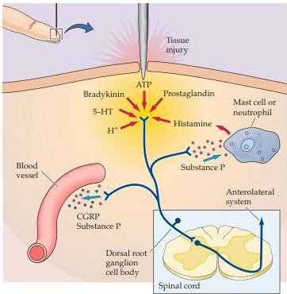

Chapter Nine

representation of pain is the least well documented aspect of the central pathways for nociception, and further studies will be needed to elucidate the contribution of regions outside the somatosensory areas of the parietal lobe.
Nevertheless, a prominent role for these areas in the perception of pain is suggested by the fact that ablations of the relevant regions of the parietal cortex do not generally alleviate chronic pain (although they impair contralateral mechanosensory perception, as expected).

## Sensitization

Following a painful stimulus associated with tissue damage (e.g., cuts, scrapes, and bruises), stimuli in the area of the injury and the surrounding region that would ordinarily be perceived as slightly painful are perceived as significantly more so, a phenomenon referred to as hyperalgesia.
A good example of hyperalgesia is the increased sensitivity to temperature that occurs after a sunburn.
This effect is due to changes in neuronal sensitivity that occur at the level of peripheral receptors as well as their central targets.

Peripheral sensitization results from the interaction of nociceptors with the "inflammatory soup" (Figure 9.6) of substances released when tissue is damaged.
These products of tissue damage include extracellular protons, arachidonic acid and other lipid metabolites, bradykinin, histamine, serotonin, prostaglandins, nucleotides, and nerve growth factor (NGF), all of which can interact with receptors or ion channels of nociceptive fibers, augmenting their response.
For example, the responses of the TRPV1 receptor to heat can be potentiated by direct interaction of the channel with extracellular protons or lipid metabolites.
NGF and bradykinin also potentiate the

Figure 9.6 Inflammatory response to tissue damage.
Substances released by damaged tissues augment the response of nociceptive fibers.
In addition, electrical activation of nociceptors causes the release of peptides and neurotransmitters that further contribute to the inflammatory response.