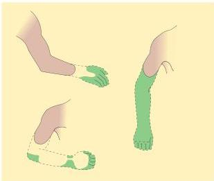
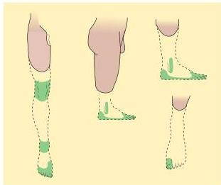

Pain 223

Drawings of phantom arms and legs, based on patients' reports.
The phantom is indicated by a dashed line, with the colored regions showing the most vividly experienced parts.
Note that some phantoms are telescoped into the stump.
(After Solonen, 1962.)

ous pain that patients find increasingly debilitating.
Phantom pain is, in fact, one of the more common causes of chronic pain syndromes and is extraordinarily difficult to treat.
Because of the widespread nature of central pain processing, ablation of the spinothalamic tract, portions of the thalamus, or even primary

sensory cortex does not generally relieve the discomfort felt by these patients.

# References

MELZACK, R.
(1989) Phantom limbs, the self, and the brain.
The D.O.
Hebb Memorial Lecture.
Canad.
Psychol.
30: 1-14.
MELZACK, R.
(1990) Phantom limbs and the concept of a neuromatrix.
TINS 13: 88-92.

NASHOLD, B.
S., Jr.
(1991) Paraplegia and pain.
In Deafferentation Pain Syndromes: Pathophysiology and Treatment, B.
S.
Nashold, Jr.
and J.
Ovelmen-Levitt (eds.).
New York: Raven Press, pp.
301-319.
RAMACHANDRAN, V.
S.
AND S.
BLAKESLEE (1998) Phantoms in the Brain.
New York: William Morrow &amp; Co.
SOLONEN, K.
A.
(1962) The phantom phenomenon in amputated Finnish war veterans.
Acta.
Orthop.
Scand.
Suppl.
54: 1-37.

preinjury levels.
However, when the afferent fibers or central pathways themselves are damaged—a frequent complication in pathological conditions that include diabetes, shingles, AIDs, multiple sclerosis, and stroke—these processes can persist.
The resulting condition is referred to as neuropathic pain, a chronic, intensely painful experience that is difficult to treat with conventional analgesic medications.
(See Box D for a description of neuropathic pain associated with amputation of an extremity.) The pain can arise spontaneously (without a stimulus) or can be produced by mild forms of stimulation that are common to everyday experience, such as the gentle touch and pressure of clothing, or warm and cool temperatures.
Patients often describe their experience as a constant burning sensation interrupted by episodes of shooting, stabbing, or electric shocklike jolts.
Because the disability and psychological stress associated with chronic neuropathic pain can be severe, much present research is being devoted to better understanding of the mechanisms of peripheral and central sensitization with the hope of more effective therapies for this debilitating syndrome.