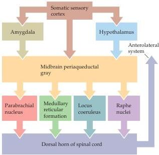
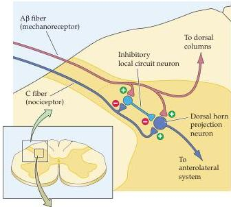
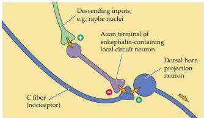

Chapter Nine

(A)

(B)
(C)

Figure 9.7 The descending systems that modulate the transmission of ascending pain signals.
(A) These modulatory systems originate in the somatic sensory cortex, the hypothalamus, the periaqueductal gray matter of the midbrain, the raphe nuclei, and other nuclei of the rostral ventral medulla.
Complex modulatory effects occur at each of these sites, as well as in the dorsal horn.
(B) Gate theory of pain.
Activation of mechanoreceptors modulates the transmission of nociceptive information to higher centers.
(C) The role of enkephalin-containing local circuit neurons in the descending control of nociceptive signal transmission.

ously rub the site of injury for a minute or two.
Such observations, buttressed by experiments in animals, led Ronald Melzack and Patrick Wall to propose that the flow of nociceptive information through the spinal cord is modulated by concomitant activation of the large myelinated fibers associated with low-threshold mechanoreceptors.
Even though further investigation led to modification of some of the original propositions in Melzack and Wall's gate theory of pain, the idea stimulated a great deal of work on pain modulation and has emphasized the importance of synaptic interactions within the dorsal horn for modulating the perception of pain intensity.

The most exciting advance in this long-standing effort to understand central mechanisms of pain regulation has been the discovery of endogenous opioids.
For centuries it had been apparent that opium derivatives such as morphine are powerful analgesics—indeed, they remain a mainstay of analgesic therapy today.
Modern animal studies have shown that a variety of brain regions are susceptible to the action of opiate drugs, particularly—and significantly—the periaqueductal gray matter and other sources of descend