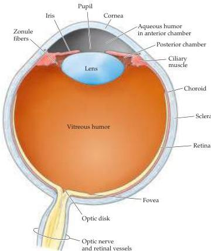

Chapter Ten

Figure 10.1 Anatomy of the human eye.

the lens and the iris) and flows into the anterior chamber through the pupil.
The amount of fluid produced by the ciliary processes is substantial: it is estimated that the entire volume of fluid in the anterior chamber is replaced 12 times a day.
Thus the rates of a aqueous humor production must be balanced by comparable rates of drainage from the anterior chamber in order to ensure a constant intraocular pressure.
A specialized meshwork of cells that lies at the junction of the iris and the cornea (a region called the limbus) is responsible for aqueous drainage.
Failure of adequate drainage results in a disorder known as glaucoma, in which high levels of intraocular pressure can reduce the blood supply to the eye and eventually damage retinal neurons.

The space between the back of the lens and the surface of the retina is filled with a thick, gelatinous substance called the vitreous humor, which accounts for about  $80\%$  of the volume of the eye.
In addition to maintaining the shape of the eye, the vitreous humor contains phagocytic cells that remove blood and other debris that might otherwise interfere with light transmission.
The housekeeping abilities of the vitreous humor are limited, however, as a large number of middle-aged and elderly individuals with vitreal "floaters" will attest.
Floaters are collections of debris too large for phagocytic consumption that therefore remain to cast annoying shadows on the retina; they typically arise when the aging vitreous membrane pulls away from the overly long eyeball of myopic individuals (Box A).