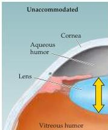
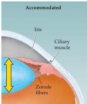

Vision: The Eye

# The Formation of Images on the Retina

Normal vision requires that the optical media of the eye be transparent, and both the cornea and the lens are remarkable examples of tissue specializations that achieve a level of transparency that rivals that found in inorganic materials such as glass.
Not surprisingly, alterations in the composition of the cornea or the lens can significantly reduce their transparency and have serious consequences for visual perception.
Indeed, cataracts (opacities in the lens) account for roughly half the cases of blindness in the world, and almost everyone over the age of 70 will experience some loss of transparency in the lens that ultimately degrades the quality of visual experience.
Fortunately, there are successful surgical treatments for cataracts that can restore vision in most cases.
Furthermore, the recognition that a major factor in the production of cataracts is exposure to ultraviolet (UV) solar radiation has heightened public awareness of the need to protect the lens (and the retina) by reducing UV exposure through the use of sunglasses.

Beyond efficiently transmitting light energy, the primary function of the optical components of the eye is to achieve a focused image on the surface of the retina.
The cornea and the lens are primarily responsible for the refraction (bending) of light that is necessary for formation of focused images on the photoreceptors of the retina (Figure 10.2).
The cornea contributes most of the necessary refraction, as can be appreciated by considering the hazy, out-of-focus images experienced when swimming underwater.
Water, unlike air, has a refractive index close to that of the cornea; as a result, immersion in water virtually eliminates the refraction that normally occurs at the air/cornea interface; thus the image is no longer focused on the retina.
The lens has considerably less refractive power than the cornea; however, the refraction supplied by the lens is adjustable, allowing objects at various distances from the observer to be brought into sharp focus.

Dynamic changes in the refractive power of the lens are referred to as accommodation.
When viewing distant objects, the lens is made relatively thin and flat and has the least refractive power.
For near vision, the lens becomes thicker and rounder and has the most refractive power (see Figure 10.2).
These changes result from the activity of the ciliary muscle that surrounds the lens.
The lens is held in place by radially arranged connective tissue bands (called zonule fibers) that are attached to the ciliary muscle.
The shape of the lens is thus determined by two opposing forces: the elasticity of the lens, which tends to keep it rounded up (removed from the eye, the lens

Figure 10.2 Diagram showing the anterior part of the human eye in the unaccommodated (left) and accommodated (right) state.
Accommodation for focusing on near objects involves the contraction of the ciliary muscle, which reduces the tension in the zonule fibers and allows the elasticity of the lens to increase its curvature.