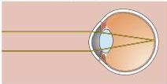
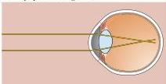
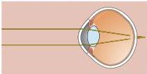

Chapter Ten

# Box A

## Myopia and Other Refractive Errors

Optical discrepancies among the various components of the eye cause a majority of the human population to have some form of refractive error, called ametropia.
People who are unable to bring distant objects into clear focus are said to be nearsighted, or myopic (Figures A and B).
Myopia can be caused by the corneal surface being too curved, or by the eyeball being too long.
In either case, with the lens as flat as it can be, the image of distant objects focuses in front of, rather than on, the retina.
People who are unable to focus on near objects are said to be farsighted, or hyperopic.
Hyperopia can be caused by the eyeball being too short or the refracting system too weak (Figure C).
Even with the lens in its most rounded-up state, the image is out of focus on the retinal surface (focusing at some point behind it).
Both myopia and hyperopia are correctable by appropriate lenses—concave (minus) and convex (plus), respectively—or by the increasingly popular technique of corneal surgery.

Myopia, or nearsightedness, is by far the most common ametropia; an estimated 50% of the population in the United States is affected.
Given the large number of people who need glasses, contact lenses, or surgery to correct this refractive error, one naturally wonders how nearsighted people coped before spectacles were invented only a few centuries ago.
From what is now known about myopia, most people's vision may have been considerably better in ancient times.
The basis for this assertion is the surprising finding that the growth of the eyeball is strongly influenced by focused light falling on the retina.
This phenomenon was first described in 1977 by Torsten Wiesel and Elio Raviola at Harvard Medical School, who studied monkeys reared with their lids sutured (the same approach used to demonstrate the effects of visual deprivation on cortical connections in the visual system; see Chapter 23), a procedure that deprives the eye of focused retinal images.
They found that animals growing to maturity under these conditions show an elongation of the eyeball.
The effect of focused light deprivation appears to be a local one, since the abnormal growth of the eye occurs in experimental animals even if the optic nerve is cut.
Indeed, if only a portion of the retinal surface is deprived of focused light, then only that region of the eyeball grows abnormally.

Although the mechanism of light-mediated control of eye growth is not fully understood, many experts now believe that the prevalence of myopia is due to some aspect of modern civilization—perhaps learning to read and write at an early age—that interferes with the normal feedback control of vision on eye development, leading to abnormal elongation of the eyeball.
A corollary of this hypothesis is that if children (or, more likely, their parents) wanted to improve their vision, they might be able to do so by practicing far vision to counterbalance the near work "overload." Practically, of about 100 people in the United States have been exposed to myopia, there is a few evidence that myopia is a normal eye, and it is not clear why myopia is a normal eye.

(A) Emmetropia (normal)

(B) Myopia (nearsighted)

(C) Hyperopia (farsighted)

Refractive errors.
(A) In the normal eye, with ciliary muscles relaxed, an image of a distant object is focused on the retina.
(B) In myopia, light rays are focused in front of the retina.
(C) In hyperopia, images are focused at a point beyond the retina.

becomes spheroidal), and the tension exerted by the zonule fibers, which tends to flatten it.
When viewing distant objects, the force from the zonule fibers is greater than the elasticity of the lens, and the lens assumes the flatter shape appropriate for distance viewing.
Focusing on closer objects requires relaxing the tension in the zonule fibers, allowing the inherent elasticity of the lens to increase its curvature.
This relaxation is accomplished by the sphincter-like contraction of the ciliary muscle.
Because the ciliary muscle forms a ring around the lens, when the muscle contracts, the attachment points of the zonule fibers move toward the central axis of the eye, thus